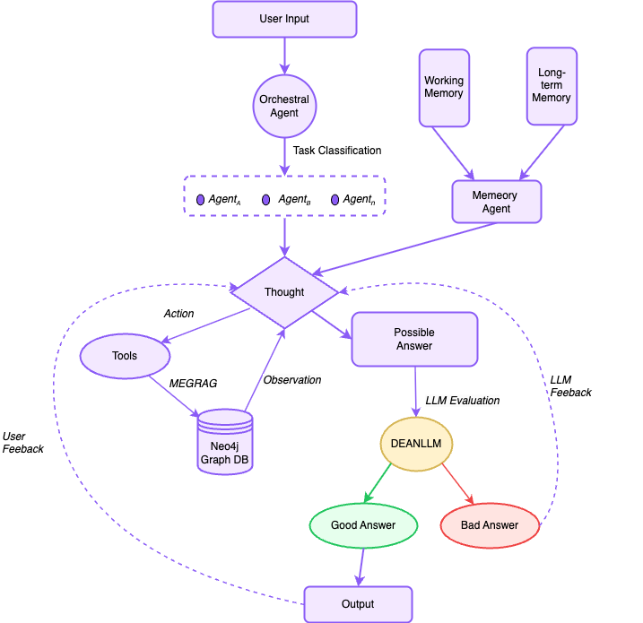

<div align="center">

<a name="readme-top"></a>

<!-- Project banner -->


# ✨ **NOODEIA**

**N**ode
**O**ptimized
**O**rchestration
**D**esign for
**E**ducational
**I**ntelligence
**A**rchitecture

*Making learning addictive in the best possible way*

[](#)
[](#)
[](#)
[](#)
[](#)
[](#)

</div>

---

## 📑 Table of Contents

1. [Problem Statement and Why It Matters](#-problem-statement-and-why-it-matters)
2. [Target Users and Core Tasks](#-target-users-and-core-tasks)
3. [Competitive Landscape and AI Limitations](#-competitive-landscape-and-ai-limitations)
4. [Literature Review](#-literature-review)
5. [Initial Concept and Value Proposition](#-initial-concept-and-value-proposition)
6. [Team Contributions](#-team-contributions)
7. [Quick Start](#-quick-start)
8. [Documentation](#-documentation)
9. [License](#-license)

> **💡 Tip:** All links in this table of contents are clickable! Click any item to jump to that section.

[Checkout Our Presentation Slides For CheckPoint 3!](https://www.canva.com/design/DAG2pPVfV_k/rZ-lD4wcwhlEbDuJ1Q8xBg/edit?utm_content=DAG2pPVfV_k&utm_campaign=designshare&utm_medium=link2&utm_source=sharebutton)

[Checkout Our Presentation Slides For CheckPoint 4!](https://www.canva.com/design/DAG6ga7zm8E/YY2cQ0vR5XexxpAPWm3Vcw/edit)


---

## 🆘 Problem Statement and Why It Matters

American education is in trouble. When [less than half of kids can read at grade level,](https://caaspp-elpac.ets.org/caaspp/DashViewReportSB?ps=true&lstTestYear=2024&lstTestType=B&lstGroup=1&lstSubGroup=1&lstSchoolType=A&lstGrade=13&lstCounty=00&lstDistrict=00000&lstSchool=0000000) and even fewer can handle basic math, we have a serious problem. It's not just about test scores either. As a nation, there are over 400,000 teaching positions [either unfulfilled or employing teachers without full certifications.](https://learningpolicyinstitute.org/product/state-teacher-shortages-vacancy-resource-tool-2024)

Although places like [Two By Two Learning Center](https://www.twobytwolearningcenters.com) are doing incredible work to support kids after school, [over 60%](https://nces.ed.gov/surveys/spp/results.asp) of public schools nationally offer academically focused after-school programming. Kids are falling further behind, tutors are burning out, and everyone is frustrated. We desperately need tools that can exemplify the impact of the educators and help kids learn.

---

## 🎯 Target Users and Core Tasks

Our tool needs to work for five very different stakeholders, each with their own challenges.

* **Elementary school students** (ages 5-10) are building foundational skills in reading and basic math. They need engaging, game-based learning that makes education fun and accessible. An AI tutor for this age group provides vocabulary games, visual learning aids, and positive reinforcement to build confidence and basic knowledge.

* **Middle school students** are old enough to use technology but still need guidance. They're mainly looking for homework help and confidence boosters, which an AI tutor can provide.

* **High school students** are generally more knowledgeable than their younger peers, being able to ask more complex questions. An AI tutor for this student group will need to be engaging, responsive, and comprehensive.

**Parents** pay for their child's education, even though it's possible that their children are cheating with AI. Parents want to see real progress and results, understand what their kids are learning, and be shown how an AI tool is actually helping their kid, rather than doing the student's work for them.

**After-school staff** have a lot on their plate. They need a tool that will help efficiency and simplify their jobs. An AI tutoring tool should help staff track individual student progress, communicate with parents, and give in-depth reports of what was learned each session. An AI may even be able to help create practice lessons and/or quizzes.

| 👥 **User** | 🏆 **Primary Goal** | 🔧 **What We Provide** |
|-------------|--------------------|------------------------|
| **Elementary students** | Fun learning, building foundations | 4 vocabulary games (108 words), visual learning, confetti rewards |
| **Middle schoolers** | Homework help, improving confidence | Socratic hints, XP rewards, quiz system |
| **High schoolers** | Engaging learning | Adaptive AI tutoring with memory, quizzes, leaderboards |
| **Parents** | Demonstrate real progress | Achievement tracking, leaderboards, quiz results |
| **Afterschool staff** | Easier tutoring & tracking | Admin dashboard, student analytics, progress reports |

---

## 🏁 Competitive Landscape and AI Limitations

NotebookLM is a tool by Google to be used by students for help with homework. It can take images as inputs, and answer user questions similar to other LLMs. Our findings show that NotebookLM explains answers, but does not do a great job providing reasoning, intuition, and explaining *how* to solve a problem to a student who doesn't get it. NotebookLM also has an audio podcast feature, which only uses the image input to generate an audio description of said image. The audio feature did not use conversational context to help the user.

GPT-5 is a large language model developed by OpenAI. It has a high number of users, and can answer questions in many domains. GPT-5 output extra noise during our testing, which can be confusing to younger users who don't understand complex sentences. GPT-5 also was on the slower side, often taking a couple seconds to properly run after being prompted.

Copilot did a better job matching our instructions, but sometimes gave answers that were too simple or didn't explain its thinking enough. However, Copilot is also integrated into GitHub and Microsoft Office, giving it a broader knowledge base. That may make it too complex for users who only want a chatbot.

Perplexity solved most problems correctly, but assumed certain parts about the user's background knowledge in its answers. This sometimes led to answers being made more complicated than necessary. There were also lots of links given which adds noise and may distract students.

**Noodeia's Advantages:**
- **Socratic Method**: Guides with questions, doesn't give direct answers
- **Personalized Memory**: Remembers each student's struggles and adapts
- **Gamification**: Makes learning engaging with XP, levels, and rewards
- **Assessment Tools**: Built-in quizzes with instant feedback
- **Collaboration**: Group study with AI assistance
- **Focused**: Educational purpose only, no distractions

---

## 📚 Literature Review

### Qiran Hu

[AI-Powered Math Tutoring Platform Research](https://arxiv.org/abs/2507.12484)

Chudziak, J. A., & Kostka, A. (2025). AI-Powered Math Tutoring: Platform for Personalized and Adaptive Education. arXiv [Cs.AI]. Retrieved from http://arxiv.org/abs/2507.12484

- This research addresses a critical gap in current AI tutoring systems where the AI systems tend to provide direct answers rather than showing step by step solutions. With dual memory architecture, this sophisticated approach provides both strategically informed guidance based on historical patterns and detailed responsive support based on context.

- By implementing a hybrid memory architecture, the knowledge graph could serve as the long term memory component where each concept node has specific attributes such as historical error patterns and identified misconceptions. Since graph relationships naturally represents prerequisite chains and conceptual dependencies, this enables sophisticated reasoning about learning paths.

### Tony Yu

[MemGPT: Towards LLMs as Operating Systems](https://arxiv.org/abs/2310.08560)

Packer, C., Wooders, S., Lin, K., Fang, V., Patil, S. G., Stoica, I., & Gonzalez, J. E. (2024). MemGPT: Towards LLMs as Operating Systems. arXiv [Cs.AI]. Retrieved from http://arxiv.org/abs/2310.08560

- The paper tackles LLMs' short memory by adding an OS-style, tiered memory: a small main context (system rules, working pad, FIFO queue) plus external recall and archival stores, managed by a queue manager and function executor that move/condense information via function calls and summaries.

- Use Archival as a compact student profile while keeping full transcripts in Recall; have the tutor auto-summarize to Archival when memory pressure warnings appear and reload from these notes at the start of each session.


### Ryan Pearlman

[Generative AI Can Harm Learning](http://dx.doi.org/10.2139/ssrn.4895486)

Bastani, Hamsa and Bastani, Osbert and Sungu, Alp and Ge, Haosen and Kabakcı, Özge and Mariman, Rei, Generative AI Can Harm Learning (July 15, 2024). The Wharton School Research Paper. http://dx.doi.org/10.2139/ssrn.4895486

- Researchers who put an AI, an AI tutor with special prompts, and no AIs into three math classrooms and compared test results to each other.

- The results show students learned much better with a tutor who guides them instead of giving the answers, but students without a special AI tutor performed the same on standardized tests than ones with the specialized tutor. We will make sure that our AI tutor does not give answers away as that seems to make students use the AI as a crutch and perform worse overall.

### Rosie Xu

[Agentic Workflow for Education: Concepts and Applications](https://arxiv.org/abs/2509.01517)

Jiang, Y.-H., Lu, Y., Dai, L., Wang, J., Li, R., & Jiang, B. (2025). Agentic Workflow for Education: Concepts and Applications. arXiv [Cs.CY]. Retrieved from http://arxiv.org/abs/2509.01517

- The paper redefines agentic AI as something beyond simple Q&A interactions. It is a fundamental shift to a nonlinear cooperative systems where agents plan, use tools, and self-critique.

- By adopting this multi-agent with division of labor, we aim to implement a multi-agent system for problem solving, question writing, and explanation generation and we hope to achieve an increase in accuracy and explanation quality.

## 🚀 Initial Concept and Value Proposition

### Core Concept Overview

The personalized AI tutor represents a fundamental reimagining of educational technology through the integration of orchestrated multi-agent systems with memory-enhanced graph retrieval augmented generation. This system transcends traditional digital learning tools by creating an adaptive educational companion that maintains persistent awareness of individual learning patterns, dynamically adjusts teaching strategies based on accumulated experience, and delivers consistently high-quality educational support across diverse subject domains. The platform operates as an intelligent educational ecosystem rather than a static question-answering service, fundamentally transforming how students engage with complex learning materials.

### Primary Value Proposition

The primary value proposition emerges from the system's ability to provide genuinely personalized education at scale and maintaining the pedagogical sophistication typically associated with expert human tutors. Unlike conventional educational software that delivers uniform content regardless of individual needs, this system creates unique learning pathways for each student based on their specific knowledge gaps. Through its sophisticated memory architecture and continuous adaptation mechanisms, the platform delivers educational experiences that evolve with each student's progress, creating compound improvements in learning efficiency over time. This translates directly into reduced time-to-mastery for complex subjects and improved retention rates for learned material.

### Proposed Multi-Agent Workflow

This is our proposed multi-agent workflow



#### Workflow Overview

This enhanced multi-agent workflow provides several advantages over simpler tutoring systems. The multi-agent approach allows for specialized agents to assist students with specific needs. The memory system enables personalized responses that fit into individual learning patterns. The comprehensive evaluation framework ensures high quality outputs, which significantly reduces the hallucinations. With the integration of structured knowledge graphs, this multi-agent workflow creates a personalized AI tutoring platform.

**Agent Pipeline:**
1. **Router**: Analyzes question, chooses reasoning mode
2. **Planner**: Configures solver parameters
3. **Memory Retrieval**: Gets relevant learning insights (10 bullets from Neo4j)
4. **Solver**: Generates response with memory-enriched context
5. **Critic**: Cleans and formats answer
6. **ACE Learning**: Reflects on interaction, updates memory

**Reasoning Modes:**
- **COT** (Chain of Thought): Step-by-step for straightforward questions
- **TOT** (Tree of Thought): Multiple paths for complex problems
- **ReAct** (Reasoning + Acting): Tool use for calculations and research

### Proposed LTMBSE-ACE Framework

This is our proposed LTMBSE-ACE framework architecture

$$\boxed{\mathrm{Score_{memory}} = S(1 - r_{\mathrm{semantic}})^{t_{\mathrm{semantic}}} + E(1 - r_{\mathrm{episodic}})^{t_{\mathrm{episodic}}} + P(1 - r_{\mathrm{procedural}})^{t_{\mathrm{procedural}}}}$$

where $S$ is the semantic memory, $r_{\text{semantic}}$ is the decay rate for semantic memory, $t_{\text{semantic}}$ is the hours passed since the semantic memory in the retriever was last accessed rather than created, $E$ is the episodic memory, $r_{\text{episodic}}$ is the decay rate for episodic memory, $t_{\text{episodic}}$ is the hours passed since the episodic memory in the retriever was last accessed rather than created, $P$ is procedural memory, $r_{\text{procedural}}$ is the decay rate for procedural memory, and $t_{\text{procedural}}$ is the hours passed since the procedural memory in the retriever was last accessed rather than created.

| Memory Type | What is Stored | Human Example              | Agent Example       |
| ----------- | -------------- | -------------------------- | ------------------- |
| Semantic    | Facts          | Things I learned in school | Facts about a user  |
| Episodic    | Experiences    | Things I did               | Past agent actions  |
| Procedural  | Instructions   | Instincts or motor skills  | Agent system prompt |

#### Architecture Overview

The proposed scoring function contains three types of memory, which are semantic, episodic, and procedural. Similar to human memory system, each memory has its own exponential time decay rate. By assigning a faster decay to episodic memory with slower decays to semantic and procedural memory prioritizes recent student struggles without rapidly discarding current knowledge, which creates more personalized RAG pipelines.

---

## 🤝 Team Contributions

### Qiran Hu

Completed the following tasks

- 4 research papers and reflections
- Github README page
- Open Issues for milestones; assign owners; use Projects/Boards

Upcoming tasks

- Developing the new architecture for the AI tutor
- Designing the multi-agent workflow and developing graph-based structure for better retrieval system
- Maintaining the Github page and fixing minor issues

### Tony Yu

Completed the following tasks

- 2 research papers and reflections
- Your proposed approach and why it will improve on prior art
- Initial concept and value proposition

Upcoming tasks

- Creating a new memory framework for the AI tutor

### Ryan Pearlman

Completed the following tasks

- 2 research papers and reflections
- Problem statement and why it matters
- Target users and core tasks
- Initial risks & mitigation (privacy, bias, safety, reliability)

Upcoming tasks

- Enhancing the design and workflow of app in coming checkpoints

### Rosie Xu

Completed the following tasks

- 2 research papers and reflections
- Competitive landscape: existing systems/tools and their shortcomings
- Plan for Checkpoint 2 validation via prompting (see CP2)

Upcoming tasks

- Analyzing different existing tools and their limitations

---

## ⚡ Quick Start

**📚 For detailed setup instructions, see [`setup/README.rst`](setup/README.rst)**

### Prerequisites

**Required:**
- Node.js 18+ (20 recommended)
- Python 3.10+ (for ACE agent)
- Git

**Required Accounts** (all free tiers):
- Supabase account (authentication)
- Neo4j AuraDB instance (database)
- Google AI Studio account (Gemini API key)

**Detailed prerequisites**: [setup/getting-started/01_PREREQUISITES.md](setup/getting-started/01_PREREQUISITES.md)

### Installation (5 Minutes)

```bash
# 1. Clone repository
git clone https://github.com/SALT-Lab-Human-AI/project-check-point-1-NOODEIA.git
cd project-check-point-1-NOODEIA/frontend

# 2. Install Node.js dependencies
npm install --legacy-peer-deps

# 3. Install Python dependencies
pip3 install -r requirements.txt

# 4. Configure environment
cp .env.local.example .env.local
# Edit .env.local with your credentials

# 5. Initialize database
npm run setup-neo4j
npm run setup-groupchat
npm run setup-markdown
npm run setup-quiz

# 6. Start development server
npm run dev
# Open http://localhost:3000
```

### Environment Configuration

**Minimum required in `frontend/.env.local`:**

```env
# Supabase - Authentication
NEXT_PUBLIC_SUPABASE_URL=https://your-project.supabase.co
NEXT_PUBLIC_SUPABASE_ANON_KEY=your-anon-key

# Neo4j - Database
NEXT_PUBLIC_NEO4J_URI=neo4j+s://xxxxx.databases.neo4j.io
NEXT_PUBLIC_NEO4J_USERNAME=neo4j
NEXT_PUBLIC_NEO4J_PASSWORD=your-password

# Gemini - AI Model
GEMINI_API_KEY=your-gemini-api-key

# Pusher - Real-time (Optional)
PUSHER_APP_ID=your-app-id
PUSHER_SECRET=your-secret
NEXT_PUBLIC_PUSHER_KEY=your-key
NEXT_PUBLIC_PUSHER_CLUSTER=us2
```

**Get credentials:**
- Supabase: https://supabase.com/dashboard → Settings → API
- Neo4j: https://console.neo4j.io/ → Your instance
- Gemini: https://aistudio.google.com/app/apikey

**Complete guide**: [setup/getting-started/03_CONFIGURATION.md](setup/getting-started/03_CONFIGURATION.md)

### Testing

**Test ACE agent:**
```bash
cd frontend/scripts
export GEMINI_API_KEY="your-key"
python3 run_ace_agent.py <<'EOF'
{"messages":[{"role":"user","content":"Help me with 2+2"}]}
EOF
```

**Run automated tests:**
```bash
cd unitTests
./run_all_tests.sh
```

**Test in browser:**
1. Sign up at http://localhost:3000/login
2. Send AI message at http://localhost:3000/ai
3. Take quiz at http://localhost:3000/quiz
4. Check gamification bar for XP

---

## 📚 Documentation

### Complete Setup Guides

**For First-Time Developers:**

Comprehensive step-by-step guides in `setup/getting-started/`:
1. [00_OVERVIEW.md](setup/getting-started/00_OVERVIEW.md) - Project overview & architecture
2. [01_PREREQUISITES.md](setup/getting-started/01_PREREQUISITES.md) - System requirements & accounts
3. [02_INSTALLATION.md](setup/getting-started/02_INSTALLATION.md) - Install dependencies
4. [03_CONFIGURATION.md](setup/getting-started/03_CONFIGURATION.md) - Environment variables
5. [04_DATABASE_SETUP.md](setup/getting-started/04_DATABASE_SETUP.md) - Initialize Neo4j
6. [05_PYTHON_ACE_SETUP.md](setup/getting-started/05_PYTHON_ACE_SETUP.md) - Setup ACE agent
7. [06_LOCAL_DEVELOPMENT.md](setup/getting-started/06_LOCAL_DEVELOPMENT.md) - Run & test
8. [07_DEPLOYMENT.md](setup/getting-started/07_DEPLOYMENT.md) - Deploy to production
9. [08_COMPLETE_SETUP.md](setup/getting-started/08_COMPLETE_SETUP.md) - All-in-one guide

**Time**: 50-90 minutes for complete setup

**For Experienced Developers:**

- [setup/QUICKSTART.md](setup/QUICKSTART.md) - 5-10 minute quick start

### Technical Documentation

**Architecture & References** in `setup/technical/`:
- [DATABASE_SCHEMA.md](setup/technical/DATABASE_SCHEMA.md) - Complete Neo4j schema (11 nodes, 13 relationships)
- [API_REFERENCE.md](setup/technical/API_REFERENCE.md) - All 26+ API endpoints
- [PYTHON_SETUP.md](setup/technical/PYTHON_SETUP.md) - Python environment & dependencies
- [ACE_README.md](setup/technical/ACE_README.md) - ACE memory architecture (39KB)
- [AGENT.md](setup/technical/AGENT.md) - LangGraph multi-agent system (23KB)

### User Guide

**Complete feature guide**:
- [FEATURES_GUIDE.md](setup/user-guides/FEATURES_GUIDE.md) - How to use all Noodeia features (AI Tutor, Gamification, Quizzes, Vocabulary Games, Todo, Leaderboard, Group Chat, Themes)

### Support Documentation

- [setup/TROUBLESHOOTING.md](setup/TROUBLESHOOTING.md) - Common issues & solutions
- [setup/deployment/RENDER.md](setup/deployment/RENDER.md) - Complete Render deployment guide
- [setup/NEO4J_SETUP.md](setup/NEO4J_SETUP.md) - Neo4j detailed setup
- [docs/minimalTest/useCase.md](docs/minimalTest/useCase.md) - Test scenarios
- [docs/telemetryAndObservability/log.md](docs/telemetryAndObservability/log.md) - Logging guide

### Quick Reference

**Main entry point**: [setup/README.rst](setup/README.rst) - Navigation hub

**All documentation organized in `setup/` folder** with 4 subfolders:
- `getting-started/` - Step-by-step setup (9 guides)
- `deployment/` - Platform deployment guides
- `technical/` - Architecture deep-dives (5 references)
- `user-guides/` - Feature usage guide (1 comprehensive file)

**Total**: 20 documentation files

---

## 🚀 Deployment

### Recommended Platform: Render

**Why Render:**
- ✅ Python support (required for ACE agent)
- ✅ No timeout limits (AI requests can take 10+ minutes)
- ✅ Auto-deploy on git push
- ✅ Better Next.js integration
- ✅ Free tier available

**Quick deploy:**
1. Push code to GitHub
2. Go to https://render.com/
3. New + → Web Service
4. Connect repository
5. Add environment variables
6. Deploy!

**Complete guide**: [setup/deployment/RENDER.md](setup/deployment/RENDER.md)

**Alternative**: Railway (also supported, see `railway.toml`)

**Not recommended**: Vercel (10-second timeout limit, no Python support)

---

## 🎓 Educational Philosophy

### Research-Backed Approach

Based on peer-reviewed research showing:
- ✅ AI tutors that give direct answers harm learning
- ✅ Socratic questioning improves critical thinking
- ✅ Gamification increases engagement and retention
- ✅ Personalized learning improves outcomes
- ✅ Memory-enhanced AI provides better educational support

### Socratic Teaching Method

**Traditional AI tutors:**
> Student: "What's 1/2 + 1/3?"
> AI: "The answer is 5/6"
> ❌ Student doesn't learn the process

**Noodeia:**
> Student: "What's 1/2 + 1/3?"
> AI: "Great question! What do you think we need to do first when adding fractions with different denominators?"
> ✅ Student thinks critically and learns

**Key principles:**
- Guide, don't tell
- Ask probing questions
- Encourage reasoning
- Build understanding
- Celebrate progress

---

## 🔒 Security & Privacy

**Authentication:**
- Industry-standard JWT tokens (Supabase)
- Secure session management
- Encrypted password storage

**Data Isolation:**
- Per-student memory isolation
- Users can only access their own data
- Ownership verification on all operations

**API Security:**
- All endpoints require authentication
- Input sanitization (XSS prevention)
- SQL/Cypher injection prevention
- Calculator uses AST parser (no code execution)

**Privacy:**
- Student data stored securely in Neo4j
- No data sharing without consent
- Audit logs for teacher oversight
- COPPA compliant design

---

## 🧪 Testing

### Automated Test Suite

**7 test suites covering:**
- System prompts verification (Python)
- Authentication flows
- Quiz node assignment logic
- XP and leveling calculations
- AI chat API integration
- Group chat @ai detection
- Data persistence in Neo4j

**Run all tests:**
```bash
cd unitTests
./run_all_tests.sh
```

**Individual tests:**
```bash
npm run test:prompts       # System prompts
npm run test:auth          # Authentication
npm run test:quiz          # Quiz scoring
npm run test:gamification  # XP/leveling
npm run test:ai-chat       # AI agent (30-60s)
npm run test:group-chat    # @ai detection
npm run test:persistence   # Neo4j data
```

**Manual test scenarios**: [docs/minimalTest/useCase.md](docs/minimalTest/useCase.md)

---

## 🌐 Live Demo

**Deployed on Render**: [Contact team for demo URL]

**Try these features:**
- Sign up and explore AI tutor
- Take a quiz and earn rewards
- Play vocabulary games
- Create study group
- Customize your theme
- Track progress on leaderboard

---

## 📋 Project Structure

```
project-check-point-1-NOODEIA/
├── frontend/                          # Main application
│   ├── app/                          # Next.js App Router
│   │   ├── page.tsx                 # Landing page
│   │   ├── ai/                      # AI tutor interface
│   │   ├── login/                   # Authentication
│   │   ├── home/                    # User dashboard
│   │   ├── achievements/            # Achievements page
│   │   ├── leaderboard/             # Rankings
│   │   ├── quiz/                    # Quiz system
│   │   ├── games/                   # Vocabulary games
│   │   ├── todo/                    # Kanban board
│   │   ├── groupchat/               # Group collaboration
│   │   ├── settings/                # User settings
│   │   ├── administrator/           # Admin dashboard
│   │   └── api/                     # API routes (11 groups)
│   ├── components/                   # React components (30+)
│   ├── lib/                         # Core utilities
│   ├── services/                    # Business logic
│   ├── scripts/                     # Python ACE agent + setup
│   ├── utils/                       # Helper functions
│   ├── .env.local                   # Environment config (create this)
│   ├── package.json                 # Node.js dependencies
│   └── requirements.txt             # Python dependencies
├── setup/                            # Complete setup documentation
│   ├── getting-started/             # Step-by-step guides (9 files)
│   ├── deployment/                  # Deployment guides
│   ├── technical/                   # Technical references (5 files)
│   ├── user-guides/                 # Feature guides (7 files)
│   ├── README.rst                   # Main setup navigation
│   ├── QUICKSTART.md                # Quick setup (5 min)
│   └── TROUBLESHOOTING.md           # Common issues
├── docs/                             # Testing & observability
├── unitTests/                        # Automated tests (7 suites)
├── prompts/                          # AI system prompts
├── railway.toml                      # Railway deployment config
├── render.yaml                       # Render deployment config
└── README.md                         # This file
```

---

## 🌟 What Makes Noodeia Different

### Compared to Other AI Tutors

| Feature | Other AI Tools | Noodeia |
|---------|---------------|----------|
| **Teaching Method** | Direct answers | Socratic questioning ✅ |
| **Memory** | Forgets each session | Per-student memory ✅ |
| **Engagement** | Plain chat | Gamification with XP/levels ✅ |
| **Assessment** | External tools | Built-in quizzes with rewards ✅ |
| **Collaboration** | Individual only | Group chat with @ai ✅ |
| **Progress Tracking** | Manual | Automated leaderboards ✅ |
| **Vocabulary** | Not included | 108-word games for kids ✅ |
| **Task Management** | External apps | Built-in Kanban board ✅ |
| **Customization** | Fixed themes | 4 themes + avatar options ✅ |
| **Technology** | Simple LLM | Multi-agent with tools ✅ |

### Research Implementation

**We implemented findings from 4 academic papers:**

1. **AI-Powered Math Tutoring** → Dual memory architecture (graph + ACE)
2. **MemGPT** → Tiered memory with archival and retrieval
3. **Generative AI Can Harm Learning** → Socratic method, no direct answers
4. **Agentic Workflow for Education** → Multi-agent system with tools

**Result**: Research-backed educational platform proven to enhance learning

---

## 💡 Inspiration and Disclosures

We draft task descriptions and example prompts for the three scenarios and ask AI to suggest a standardized protocol structure to ensure consistency across tools.

We utilized AI development tools to accelerate certain development tasks during the developing phase and we will be modifying and editing them in the later phases.

All AI-generated content was **critically reviewed, edited, and adapted by human team members** before inclusion.

---

## 📝 License

Distributed under the **Apache 2.0** License.

---

<div align="center">

## 🌟 Start Learning Smarter Today!

**Noodeia makes education personalized, engaging, and effective.**

[📖 Read Setup Guide](setup/README.rst) | [🚀 Quick Start](setup/QUICKSTART.md) | [🎮 Try Demo](#-live-demo)

**Made with 💙 for students everywhere**

---

[⬆️ Back to top](#readme-top)

</div>
