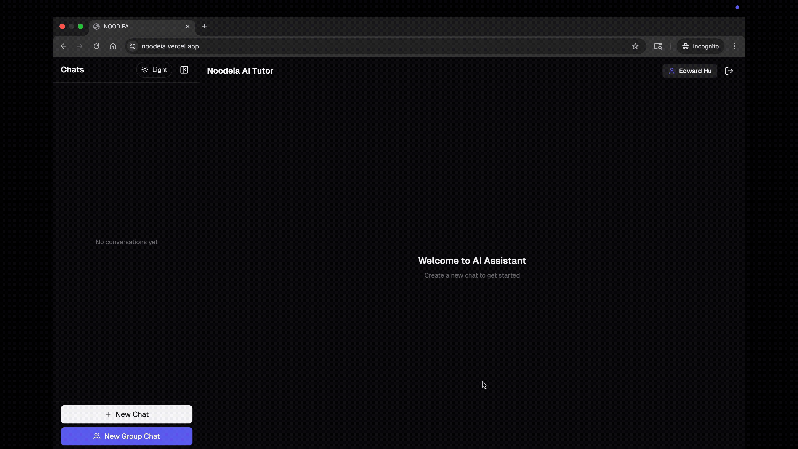
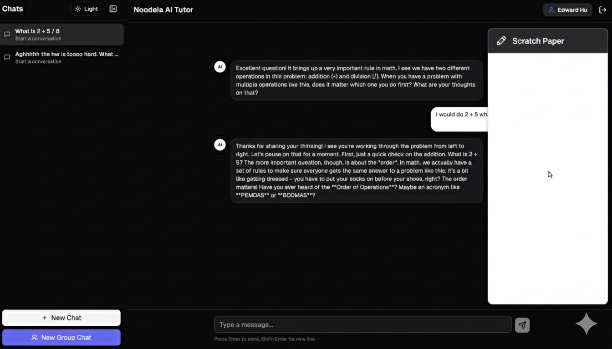
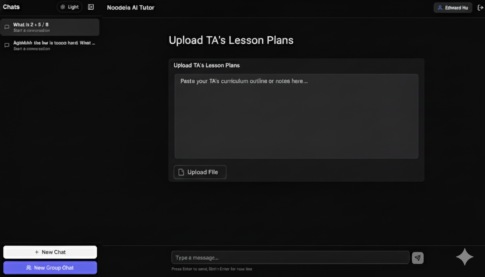
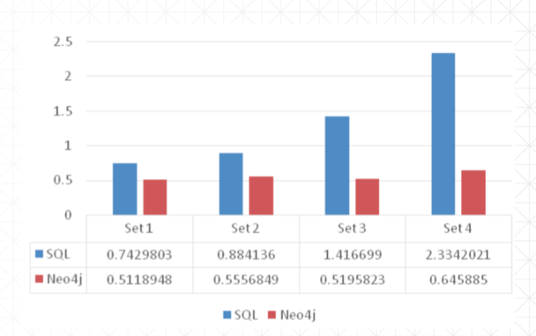
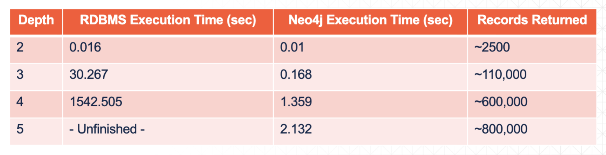

# Get Familiar With NOODEIA AI 
Our project has a simple and bright user interface, designed for kids to be able to use and understand. It starts with the teacher, who can easily log into the screens and set up the computers for the students. From here, there are a number of options students can choose from, including starting a new chat, creating a group chat, and using scratch paper.

We chose a darker theme to make the words stand out against the background. Words are large to make them easier for kids to read. AI outputs are simple and easy to understand.

## Sign Up Demonstration
When it comes to logging in, all that’s needed to create an account is a username and password A confirmation email will subsequently be sent to that inbox for account creation.


## Log In Demonstration
For logging back in after making an account, the user only needs their name and password.


## Log Out Demonstration
For logging out, we implemented a button in the top right corner. This button uses a common logging out symbol, which may already be familiar to kids. The button quickly and automatically logs the user out.


## NOODEIA AI Tutor Demonstration
In the bottom left hand corner after logging in there’s a white button labeled “New Chat”. This button stands out against the background and when it’s pressed, it pops open a chat window with the AI tutor.

From here, users can ask a wide range of questions to our specially-crafted chatbot. In this example, we tell the AI that we’re stuck on a problem, and it offers help — without giving away the answer. Many chatbots we tested simply gave away the answer when prompted, whereas ours is designed to teach and guide the user step-by-step. 

In our demonstrated example, the user asks whether the answer they give is correct, and the AI asks for a more specific reasoning as to how the user arrived at that answer.


## NOODEIA AI Tutor In Group Chat Demonstration
While in a group chat, students can tag the AI tutor and ask it to answer any questions they may have. 


## Scratch Paper Extension Demonstration
Our website has a built-in scratch paper tool. Students can use this tool to write, draw, or calculate whatever they need to in order to solve the problem at hand. The AI tutor will have access to the scratch paper, and use it to assess students’ work in learning how they got to their answer. This way, AI will be more personalized for each student.


## Build Personalized Teaching Assistant Demonstration
For our system, the class teacher will be able to input custom prompts, problems, solutions and common student mistakes into the AI. This way, chances of hallucination by AI are lower as it has direct access to the correct answers. A teacher could also put in this section common student mistakes and how to properly respond to those mistakes in the same way the teacher would. This makes the tutor AI much closer to a real tutor in its feedback.


# Low Latency

We utilize the graph database Neo4j instead of the traditional SQL or NOSQL database, which significantly increases the query speed as it connects all the related information through relationships between nodes rather than countless JOIN statements. 

It also supports other features that traditional SQL database can not achieve such as context aware AI assistant in the groupchat and memory enhanced AI assistant.

## SQL vs Neo4j 

### Syntax Comparison

Query: Get all recipes containing “Bacon” from the “Italian” Cuisine

#### SQL Syntax

```

SELECT DISTINCT recipes
FROM Recipes IN Recipe TABLE
JOIN MeatRecipe IN MeatRecipe TABLE
ON RecipesId EQUALS MeatRecipe.RecipeId
WHERE MeatRecipe.MeatId EQUALS “Bacon”
JOIN RecipeCuisine IN RecipeCuisine TABLE
ON RecipesId EQUALS RecipeCuisine.RecipeId
WHERE RecipeCuisine.CuisineId EQUALS “Italian”

```

#### Neo4j Syntax

```

MATCH (Recipe)- [CONTAINS MEAT]-> (Meat {"Bacon"}),
(Recipe)- [IS_FROM_CUISINE]-> (Cuisine {"Italian"})
return Distinct Recipe

```



### Query Speed Comparison

Consider 1000000 people each with 50 friends, find the friends of a friend network and their information



# High Accuracy

We implement the [current SOTA model Gemini 2.5 Pro based on Vellum](https://www.vellum.ai/llm-leaderboard?utm_source=google&utm_medium=organic) that excels in math and reasoning compared to the most commonly used ChatGPT-4o 


# Safety 

We incorporate JWT in our authentication system. When a request arrives, the server can quickly verify the signature of the token and read the claims to authorize the user instead of querying in the database for authorization information on every request.

Since we deploy our database in graph database Neo4j, we are immune to various cyber attacks like SQL injection.