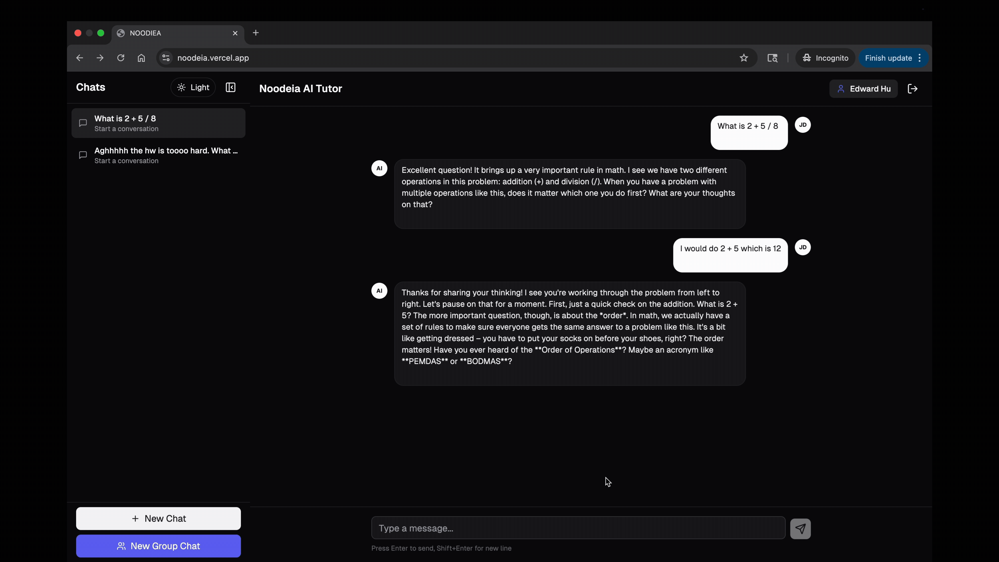
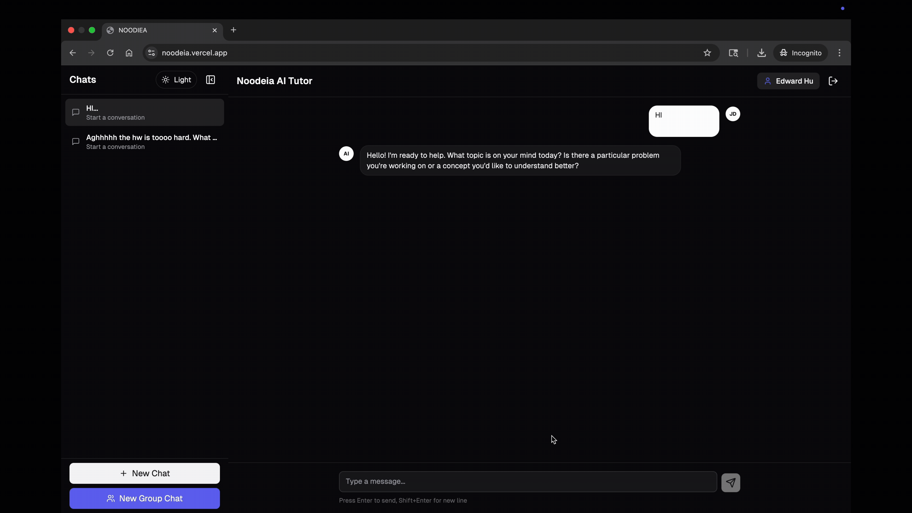
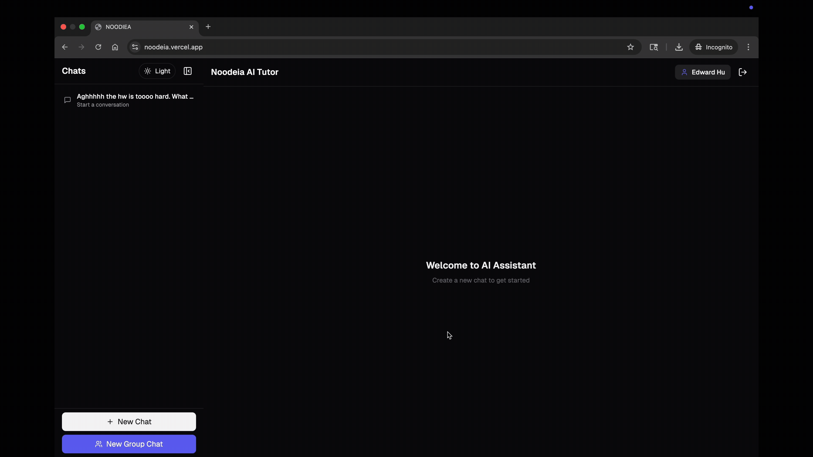
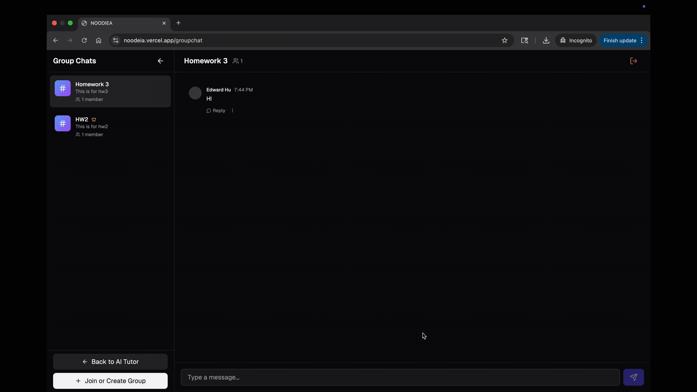

# Explore NOODEIA Interface

## Create Group Chat 
With the group chat button, users are able to seamlessly create a new chat to discuss and solve specific homework problems or assignments together. This feature makes homework for interactive, and allows shared learning. Peers can exchange information, ways to solve the problem, and tutor each other. 

## Join And Leave Group Chat
Group chats require a key to join. This helps ensure safety, such that students are only communicating with those they’re supposed to be communicating with.

## Voice Assistance
Users can press the “Play” button on a chat to listen to its contents. Kids who are unable to read the text on screen themselves can have it read to them out loud instead. This also helps with accessibility.

## Rename And Delete Chat
Chats can be renamed to reflect the current conversation topic. This allows students and teachers to better organize their work over time. Chats can also be deleted, saving space and stopping students from looking back at their previous answers if they want to start over. 

## Switch Theme
Although the interface is in dark mode by default, users can switch it to light mode if preferred. This helps with accessibility for students who have trouble reading on darker backgrounds.

## Resend And Edit
By pressing the “Edit” button, users can edit a message to fix any typos or try a question again.

By pressing the “Resend” button, users can prompt the AI a second time with the same message. This is useful when students don’t like the response given the first time.

## Minimize Chat Bar
There’s a tab on the top left corner of the application that when pressed collapses the open chats. This gives more on-screen room for text, such as prompts and outputs to be written and viewed. This is a quality of life change, and also helps for accessibility on mobile where limited screen room is available.

## Mobile And Tablet
Our application works on mobile. Users can interact with the tutor AI, and chat the same way they would on a larger screen. The color scheme and overall design themes remain the same on both platforms.

## Reply To Others In Group Chat
Group chats have thread-like replies, which can be accessed by pressing the “Reply” button on another user’s message. These replies remain after closing the app, and can be used to talk to other students, ask follow-up questions, or work together as a team by exchanging notes on a larger problem.
