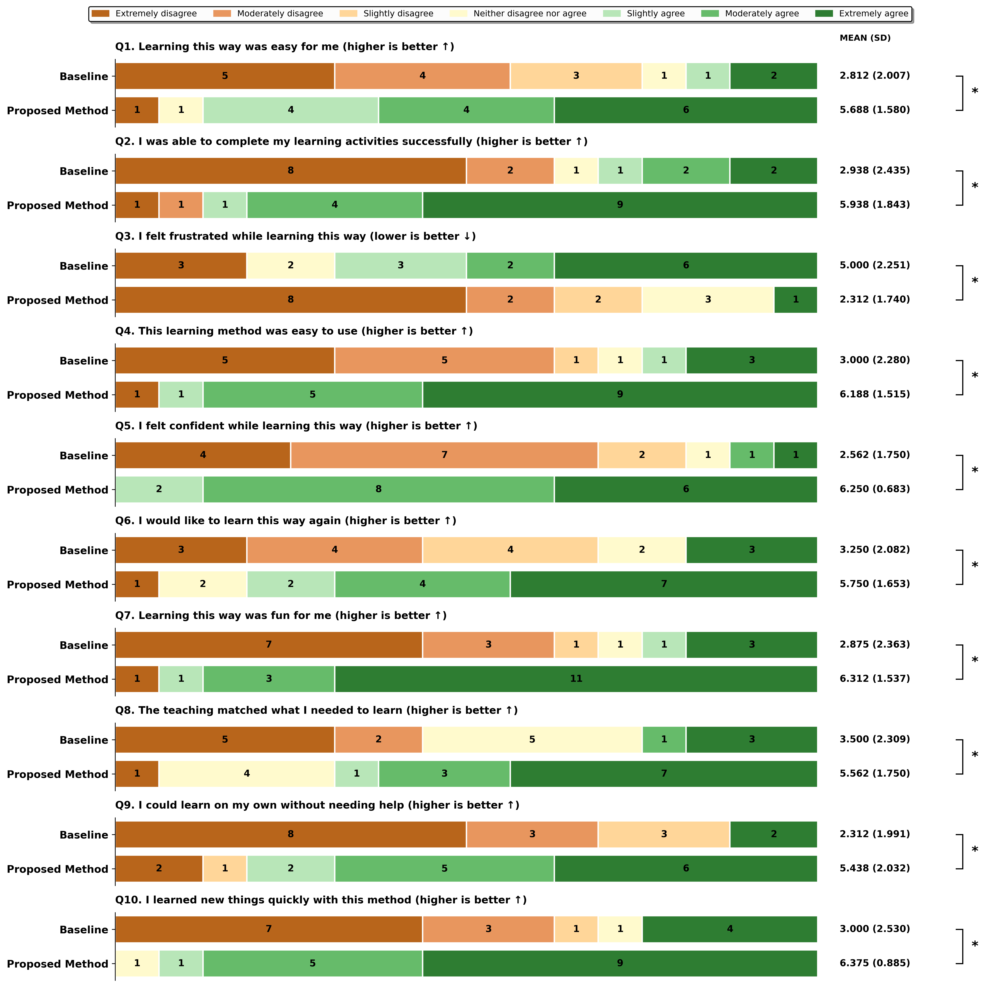

# NOODEIA: Long-Term Memory-Based Self-Evolving Agentic Context Engineering for Personalized AI Tutoring

Authors: \[Author Names\]

* * *

## Abstract

American education faces a critical challenge: fewer than half of students read at grade level, and over 400,000 teaching positions remain unfilled or understaffed. While after-school programs work to address these gaps, traditional one-to-many instruction cannot provide the personalized attention that struggling learners need. We present NOODEIA, an AI-powered tutoring platform that implements Long-Term Memory Based Self-Evolving Agentic Context Engineering (LTMBSE-ACE), a novel memory architecture that mimics human cognitive systems through semantic, episodic, and procedural memory components with exponential decay functions. Unlike existing AI tutoring tools that either provide direct answers or lack persistent personalization, NOODEIA employs Socratic pedagogy while maintaining cross-session memory of each learner's struggles, misconceptions, and progress. We conducted a counterbalanced within-subjects study (N=16) comparing NOODEIA against traditional tutoring methods at Two By Two Learning Center. Results showed statistically significant improvements across all ten measured dimensions, with the largest effects on learner confidence (+144%), independence (+135%), enjoyment (+120%), and perceived learning speed (+113%). These findings demonstrate that memory-based AI tutoring can substantially enhance the learning experience for students who are performing below grade level.

Keywords: AI tutoring, intelligent tutoring systems, long-term memory, multi-agent systems, gamification, Socratic method, educational technology, human-computer interaction

CCS Concepts: • Human-centered computing → Interactive systems and tools; Empirical studies in HCI • Applied computing → Interactive learning environments; Computer-assisted instruction

* * *

## 1 Introduction

American education is in crisis. Fewer than half of children can read at grade level, and even fewer can handle basic mathematics at expected proficiency (California Assessment of Student Performance and Progress, 2024). Beyond test scores, over 400,000 teaching positions are either unfulfilled or staffed by teachers without full certifications (Learning Policy Institute, 2024). The COVID-19 pandemic exacerbated these challenges, with students experiencing learning deficits equivalent to approximately "35% of a school year" (Betthäuser et al., 2023, p. 380). By Spring 2023, students had recovered only 30% of their pandemic-related mathematics losses (Kane & Reardon, 2024).

Organizations like Two By Two Learning Center are doing important work to support children after school. However, over 60% of public schools nationally offer academically focused after-school programming that still relies on traditional one-to-many instruction (National Center for Education Statistics, 2023). Children are falling further behind, tutors are experiencing burnout, and everyone involved is frustrated. Hence, tools can amplify the impact of educators and help children learn effectively are urgently needed.

Research on the "two-sigma problem" demonstrated that students receiving one-on-one tutoring perform two standard deviations better than those in traditional classroom instruction (Bloom, 1984, p. 4). However, providing individualized tutoring to every struggling student is economically infeasible. Intelligent Tutoring Systems (ITS) have attempted to bridge this gap, achieving effect sizes between d=0.66 and d=0.79 compared to traditional instruction (Kulik & Fletcher, 2016; VanLehn, 2011). Yet existing systems face significant limitations: they lack persistent memory across sessions, cannot adapt to individual learning patterns over time, and often fail to engage young learners.

We present NOODEIA, an AI-powered tutoring platform designed specifically for students performing below grade level. NOODEIA addresses three critical gaps in existing educational AI:

1.  Persistent Personalization: Through our Long-Term Memory Based Self-Evolving Agentic Context Engineering (LTMBSE-ACE) framework, NOODEIA maintains cross-session memory of each learner's struggles, misconceptions, and progress, enabling truly personalized instruction that improves over time.  
      
    
2.  Socratic Pedagogy: Unlike systems that simply provide answers, NOODEIA guides learners through questioning, promoting critical thinking and deeper understanding rather than answer-seeking behavior.  
      
    
3.  Engagement Through Gamification: Recognizing that struggling learners often have negative associations with education, NOODEIA incorporates game-based elements grounded in Self-Determination Theory to rebuild intrinsic motivation.  
      
    

This paper makes the following contributions:

*   Technical Contribution: We introduce LTMBSE-ACE, a novel memory architecture for educational AI that combines semantic, episodic, and procedural memory components with biologically-inspired exponential decay functions, enabling persistent personalization across learning sessions.  
      
    
*   Design Contribution: We present the complete NOODEIA system, demonstrating how Socratic pedagogy, adaptive memory, and gamification can be integrated into a cohesive platform for struggling learners aged 5-12.  
      
    
*   Empirical Contribution: We report results from a counterbalanced within-subjects study (N=16) showing statistically significant improvements across all measured dimensions when comparing NOODEIA to traditional tutoring methods.  
      
    

* * *

## 2 Background and Related Work

### 2.1 The Two-Sigma Problem and Intelligent Tutoring Systems

The "two-sigma problem" established that one-to-one tutoring produces learning gains approximately two standard deviations above traditional classroom instruction (Bloom, 1984, p. 4). This finding has motivated decades of research into Intelligent Tutoring Systems (ITS) that attempt to replicate the benefits of human tutoring at scale.

A comprehensive review found that human tutoring achieves an effect size of d=0.79 compared to no tutoring, while ITS achieve d=0.76—remarkably close to human performance (VanLehn, 2011, p. 197). The "interaction plateau hypothesis" suggests that both human tutors and ITS derive their effectiveness from the same mechanism: supporting students in constructing knowledge through interactive problem-solving (VanLehn, 2011, p. 213). A meta-analysis of 107 studies (N=14,321) found that ITS outperform teacher-led instruction with an effect size of g=0.42 and large-group instruction with g=0.57 (Ma et al., 2014, p. 901).

More recent work has explored the integration of Large Language Models (LLMs) into tutoring systems. GPT-generated hints match the effectiveness of human-authored hints in mathematics tutoring (Ritter et al., 2024). Socratic AI tutoring promotes critical thinking more effectively than direct instruction approaches (SPL Research Team, 2024). However, current LLM-based tutoring systems lack persistent memory across sessions, limiting their ability to provide truly personalized instruction.

### 2.2 Memory Architectures for LLM-Based Agents

The challenge of maintaining long-term context in LLM-based systems has received significant attention. MemGPT manages virtual context through hierarchical memory tiers, enabling "unbounded context" through intelligent pagination (Packer et al., 2023). Generative Agents maintain a "memory stream" of observations, using recency, relevance, and importance scoring for retrieval (Park et al., 2023). MemoryBank implements Ebbinghaus forgetting curves to model memory decay over time (Zhong et al., 2024).

These architectures draw on cognitive science research distinguishing different memory systems. The fundamental distinction between "episodic memory" (personal experiences) and "semantic memory" (general knowledge) provides the theoretical foundation for memory architectures (Tulving, 1972, p. 382). The forgetting curve, expressed as R(t) = e^(-t/S), demonstrated that memory retention decreases exponentially over time without reinforcement (Ebbinghaus, 1885).

Our LTMBSE-ACE framework extends these approaches by implementing three distinct memory types—semantic, episodic, and procedural—each with configurable decay rates optimized for educational contexts. Unlike prior work focused on general-purpose agents, LTMBSE-ACE is specifically designed for educational applications, capturing not just facts but also learning strategies, misconceptions, and procedural knowledge.

### 2.3 Gamification in Educational Technology

Gamification is defined as "the use of game design elements in non-game contexts" (Deterding et al., 2011, p. 9). In educational settings, gamification has shown promising results for engagement and learning outcomes. A meta-analysis found effect sizes of g=0.49 for cognitive outcomes and g=0.36 for motivational outcomes, with larger effects observed in K-12 populations compared to higher education (Sailer & Homner, 2020, p. 97).

Self-Determination Theory (SDT) provides a theoretical foundation for effective gamification design, identifying three basic psychological needs: "competence" (feeling effective), "autonomy" (feeling in control), and "relatedness" (feeling connected) (Ryan & Deci, 2000, p. 68). Specific game elements map to these psychological needs: badges and leaderboards satisfy competence needs, while avatars and social features support relatedness (Sailer et al., 2017, p. 375).

However, gamification is not universally beneficial. Poorly implemented gamification, particularly excessive use of badges and leaderboards without meaningful challenge, can actually decrease intrinsic motivation over time (Hanus & Fox, 2015, p. 157). Flow theory suggests that optimal engagement occurs when challenge level matches skill level, highlighting the importance of adaptive difficulty in gamified learning systems (Csikszentmihalyi, 1990).

### 2.4 Limitations of Existing AI Tutoring Tools

We evaluated several existing AI tools against the needs of our target population. NotebookLM (Google) accepts image inputs and answers questions, but our testing revealed it explains answers without providing reasoning or intuition. It fails to explain how to solve problems to students who do not understand the underlying concepts. GPT-4/GPT-5 (OpenAI) has broad capabilities but outputs verbose responses that can confuse younger users who struggle with complex sentences. Response latency of several seconds can also disrupt the learning flow for children with limited attention spans. Copilot (Microsoft) better matched our instructions but sometimes provided oversimplified answers without adequate explanation of reasoning. Perplexity solved most problems correctly but assumed background knowledge that led to unnecessarily complicated explanations.

These limitations motivated the development of NOODEIA, which differentiates itself through Socratic methodology that guides with questions rather than providing direct answers, personalized memory that remembers each student's struggles across sessions, gamification that makes learning engaging through XP, levels, and rewards grounded in SDT, and a focused design for educational purposes only to minimize distractions.

* * *

## 3 Formative Study

To understand the challenges faced by educators and learners at after-school tutoring programs, we conducted formative research at Two By Two Learning Center, a non-profit organization serving elementary and middle school students who are performing below grade-level expectations.

### 3.1 Setting and Methods

Two By Two Learning Center provides after-school academic support to students aged 5-14 from low-income families. We conducted semi-structured observations of tutoring sessions. The observations focused on understanding how tutors manage multiple students, common learning challenges, and engagement patterns. Interviews explored perceived needs, current tool usage, and desired improvements.

### 3.2 Findings

Our formative research revealed several key challenges:

#### 3.2.1 Difficulty Providing Individualized Attention

Tutors consistently reported struggling to meet each student's individual needs. One tutor explained that she has six kids at different levels working on different things. While she was helping one with fractions, another was stuck on reading and two others were getting distracted. This one-to-many dynamic meant that students often waited extended periods for assistance, leading to disengagement and frustration.

#### 3.2.2 Lack of Cross-Session Continuity

Each tutoring session essentially started fresh, with tutors relying on brief notes or memory to recall what individual students had worked on previously. A tutor noted that she might remember that someone struggles with word problems, but she could not remember exactly what they tried last time or what worked for her. This lack of persistent student profiles limited the ability to build on prior progress or avoid repeating unsuccessful strategies.

#### 3.2.3 Student Disengagement and Negative Affect

Many students arrived at tutoring with negative associations about learning stemming from repeated academic failures. Tutors observed that traditional worksheets often triggered anxiety or avoidance behaviors. \[some examples\]

#### 3.2.4 Need for Immediate, Adaptive Feedback

When tutors were occupied with other students, struggling learners often sat with incorrect work, reinforcing misconceptions. The delay between making an error and receiving correction could extend to 10-15 minutes during busy sessions. Students needed immediate feedback that adapted to their specific errors and thinking patterns.

### 3.3 Design Goals

Based on these findings, we formulated three design goals for NOODEIA:

DG1: Provide Personalized Support Through Persistent Memory. The system must maintain detailed knowledge of each learner's struggles, successes, and learning patterns across sessions. This memory should enable increasingly personalized instruction that builds on prior interactions rather than starting fresh each time.

DG2: Foster Independent Learning Through Guided Discovery. Rather than providing answers or requiring constant tutor supervision, the system should guide learners to discover solutions themselves through scaffolded questioning. This approach should reduce dependence on adult assistance while building problem-solving skills.

DG3: Rebuild Motivation Through Engaging, Low-Stakes Interactions. The system must transform the affective experience of learning for students with negative academic associations. Game-based elements and encouraging feedback should create a safe, engaging environment where struggle is normalized and effort is celebrated.

* * *

## 4 NOODEIA System

Based on our design goals, we developed NOODEIA (Figure 1), an AI-powered tutoring platform that combines persistent memory, Socratic pedagogy, and gamification to provide personalized learning support for struggling students. This section describes the system architecture, interface design, and key technical components.

### 4.1 Design Context and Target Users

NOODEIA was developed in collaboration with Two By Two Learning Center for elementary and middle school students (ages 5-14) performing below grade-level expectations. The system must work for diverse stakeholders with different needs:

| User Group | Primary Goal | NOODEIA Features |
| --- | --- | --- |
| Elementary students (5-10) | Fun learning, building foundations | 4 vocabulary games (108 words), visual learning, confetti rewards |
| Middle schoolers (11-14) | Homework help, improving confidence | Socratic hints, XP rewards, quiz system |
| Parents | Demonstrate real progress | Achievement tracking, leaderboards, quiz results |
| After-school staff | Easier tutoring and tracking | Admin dashboard, student analytics, progress reports |

### 4.2 Theoretical Framework

NOODEIA's design integrates five theoretical frameworks that address our design goals:

Cognitive Load Theory addresses DG1 by informing how the adaptive scaffolding reduces "extraneous cognitive load" while maintaining "germane load" for learning (Sweller, 1988, p. 259). The LTMBSE-ACE memory system retrieves only the most relevant context for each interaction.

Self-Efficacy Theory addresses DG2 by guiding how "mastery experiences," immediate feedback, and encouraging AI responses build learner confidence through successful guided discovery (Bandura, 1977, p. 195).

Self-Determination Theory addresses DG3 by informing how game elements are designed to satisfy competence, autonomy, and relatedness needs, rebuilding intrinsic motivation (Ryan & Deci, 2000, p. 68).

Control-Value Theory addresses DG3 by informing how the system manages "achievement emotions" through maintaining optimal challenge levels and providing learner control over pace (Pekrun, 2006, p. 317).

Flow Theory addresses DG2 and DG3 by guiding how adaptive difficulty ensures challenges match skill level to maintain engagement without frustration (Csikszentmihalyi, 1990).

### 4.3 System Overview

NOODEIA consists of five primary components (Figure 1):

1.  AI Tutor: Conversational interface for Socratic learning interactions
    
2.  LTMBSE-ACE Memory System: Persistent, learner-specific knowledge store
    
3.  Gamification Engine: XP, leveling, achievements, and leaderboards
    
4.  Learning Activities: Quizzes and vocabulary games
    
5.  Collaboration Tools: Group chat with AI assistance
    

### 4.4 AI Tutor Interface

The AI Tutor (Figure 2) provides the primary learning interface where students engage in Socratic dialogue. The interface includes:

Conversation Panel: Students type questions or describe problems they are working on. The AI responds with guiding questions rather than direct answers, prompting learners to think through problems step-by-step.

Context Display: Relevant memories about the student's prior struggles and successes are used to personalize responses, though this context is not directly visible to students to avoid complexity.

XP Indicator: Students earn 1.01-1.75 XP for each message exchange, with a visual animation showing progress toward the next level.

#### 4.4.1 Socratic Pedagogy

The AI tutor employs Socratic questioning rather than direct instruction:

| Scenario | Traditional AI | NOODEIA Socratic |
| --- | --- | --- |
| Student asks: "What is 1/2 + 1/3?" | "The answer is 5/6" | "What do we need to do first when adding fractions with different denominators?" |
| Student struggles | Provides step-by-step solution | "What do you notice about the denominators 2 and 3?" |
| Student succeeds | "Correct!" | "Great! Can you explain why we needed a common denominator?" |

This approach promotes critical thinking and helps students develop problem-solving strategies rather than answer-seeking behavior.

#### 4.4.2 Personality Calibration

The tutor maintains a warm, encouraging tone appropriate for struggling learners. It uses age-appropriate vocabulary, celebrates effort and progress rather than just correct answers, normalizes mistakes as part of learning, and maintains patience through multiple attempts.

### 4.5 LTMBSE-ACE Memory Architecture

The Long-Term Memory Based Self-Evolving Agentic Context Engineering (LTMBSE-ACE) framework provides persistent, personalized memory for each learner (Figure 3). This section details the technical design.

#### 4.5.1 Design Rationale

Traditional approaches to LLM-based tutoring face fundamental limitations that LTMBSE-ACE addresses:

| Limitation | Traditional Approach | LTMBSE-ACE Solution |
| --- | --- | --- |
| Context window exhaustion | Replay entire transcript each turn | Compressed memory bullets with retrieval |
| No cross-session memory | Notes disappear when chat ends | Persistent Neo4j storage per learner |
| No personalization | Same approach for all students | Learner-specific memory entries |
| No learning from experience | Agent cannot refine strategies | Reflect-Generate-Curate pipeline |
| Static knowledge | Fixed prompt templates | Self-evolving memory through reinforcement |

#### 4.5.2 Memory Components

LTMBSE-ACE implements three memory types inspired by human cognitive architecture (Tulving, 1972, p. 385):

| Memory Type | Human Analogy | Educational Function | Default Decay Rate |
| --- | --- | --- | --- |
| Semantic | School knowledge, facts | Domain concepts, definitions, formulas | 1% per access |
| Episodic | Personal experiences | Student-specific events, struggles, breakthroughs | 5% per access |
| Procedural | Motor skills, habits | Problem-solving strategies, pedagogical approaches | 0.2% per access |

The differentiated decay rates reflect how different types of knowledge persist. Procedural memories (like effective teaching strategies) should persist longer than episodic memories (like a specific interaction event), mirroring human memory characteristics.

#### 4.5.3 Memory Scoring Function

Each memory entry receives a composite score based on the exponential decay equation:

Score\_memory = S(1 - r\_s)^t\_s + E(1 - r\_e)^t\_e + P(1 - r\_p)^t\_p

Where S, E, and P are base strengths for semantic, episodic, and procedural components; r\_s, r\_e, and r\_p are component-specific decay rates; and t\_s, t\_e, and t\_p are access events since each component was last retrieved.

#### 4.5.4 Self-Evolving Memory Pipeline

The LTMBSE-ACE pipeline processes each tutoring interaction through three stages:

Reflector Stage: After each interaction, the system analyzes what occurred and extracts lessons learned about the student and effective pedagogical approaches. For example, if a student struggled with common denominators, the reflector generates a structured lesson object noting this difficulty.

Generator Stage: The system plans pedagogical approaches for future interactions based on accumulated knowledge. It identifies which strategies have been effective and recommends approaches for similar future situations.

Curator Stage: The system transforms extracted lessons into memory deltas—new entries to add, existing entries to reinforce, or outdated entries to remove. Key operations include:

*   Reinforcement: When a strategy succeeds, the corresponding memory entry's helpful count increases, boosting retrieval priority.
    
*   Deduplication: Semantically similar entries (>90% similarity) are merged, with the higher-signal entry preserved.
    
*   Pruning: Low-score entries are removed when memory exceeds capacity (default: 200 entries per learner).
    

#### 4.5.5 Context Engineering Pipeline

Each tutoring turn follows a six-stage pipeline:

| Stage | Process | Purpose |
| --- | --- | --- |
| 1. Query Analysis | Extract topic, facets, learner intent | Determine retrieval parameters |
| 2. Memory Retrieval | Fetch top-k relevant bullets | Gather personalized context |
| 3. Context Injection | Format memories into prompt | Enrich LLM context |
| 4. Response Generation | Socratic questioning via LLM | Produce pedagogical response |
| 5. Reflection | Analyze interaction outcome | Extract lessons learned |
| 6. Memory Update | Apply deltas to memory store | Evolve knowledge base |

### 4.6 Gamification System

The gamification system addresses DG3 by transforming the affective experience of learning through game-based elements grounded in Self-Determination Theory.

#### 4.6.1 Experience Points and Leveling

Students earn XP through various learning activities:

| Activity | XP Reward | Rationale |
| --- | --- | --- |
| AI Tutor message | 1.01-1.75 XP | Encourages engagement with Socratic dialogue |
| Completed task | 1.01-1.75 XP | Rewards task completion |
| Quiz (based on score) | 3-30 XP | Higher rewards for mastery |
| Vocabulary games | 2-24 XP | Varies by difficulty |

Level progression follows a quadratic formula: XP for Level X = ((X-1)² + 4)². This creates a curve where early levels are achievable to build momentum, while later levels require sustained engagement.

#### 4.6.2 SDT-Aligned Game Elements

| Game Element | SDT Need | Implementation |
| --- | --- | --- |
| XP and levels | Competence | Visual progress toward mastery |
| Achievement badges | Competence | Recognition of specific accomplishments |
| Leaderboards | Competence + Relatedness | Optional social comparison |
| Avatar customization | Autonomy | Personal expression and ownership |
| Learning path choice | Autonomy | Student-directed exploration |
| Group chat | Relatedness | Collaborative learning support |

#### 4.6.3 Reward Animation Design

Quiz completion triggers a multi-stage reward animation inspired by gacha game mechanics to create anticipation and celebration:

| Score | Reward Tier | Animation | XP |
| --- | --- | --- | --- |
| 100% | Legendary | Gold orb with crown, 720° flip, 400-particle confetti | 25-30 |
| 80-99% | Rare | Pink orb, confetti explosion | 12-15 |
| 30-79% | Common | Standard orb reveal | 3-7 |

### 4.7 Learning Activities

#### 4.7.1 Quiz System

The quiz system provides structured assessment with immediate feedback and adaptive difficulty:

*   Question Count: 10 multiple-choice questions per quiz
    
*   Adaptive Difficulty: Adjusts based on performance history from memory
    
*   Immediate Feedback: Correct/incorrect shown after each question
    
*   Memory Integration: Wrong answers inform the LTMBSE-ACE system for future personalization
    

#### 4.7.2 Vocabulary Games

Four game modes target different learning objectives with varying challenge levels:

| Game | Difficulty | Mechanic | XP per Round |
| --- | --- | --- | --- |
| Word Match | Easy | Match words with emoji pictures | 8-11 |
| Memory Cards | Hard | Classic memory matching | 2-5 per pair |
| Spelling Bee | Medium | Type correct spelling from clues | 21-24 per word |
| Word Builder | Expert | Build words from scrambled letters | 14-17 per word |

The vocabulary bank contains 108 words across 8 categories: Animals (32), Fruits (15), Vegetables (8), Weather (9), Body Parts (8), School Items (8), Vehicles (14), and Foods (14).

### 4.8 Technical Implementation

NOODEIA is implemented as a web application using Next.js for the frontend and a Python backend for the AI components. The LTMBSE-ACE memory system uses Neo4j for persistent storage, with each learner having an isolated memory node. Authentication is handled through Supabase, and the AI tutor uses Gemini as the underlying LLM with custom prompting for Socratic pedagogy.

### 4.9 Safety and Privacy Considerations

Given our target population of children, we implemented several safety measures:

| Consideration | Design Decision |
| --- | --- |
| No direct answers | Socratic method prevents homework cheating |
| Warm tone | Non-judgmental responses support struggling learners |
| Privacy | Individual memory not shared across users |
| Data isolation | Per-learner Neo4j memory nodes |
| Content filtering | AI responses sanitized for age-appropriateness |
| Parental visibility | Progress reports available to parents/staff |

* * *

## 5 User Evaluation

We conducted a user evaluation with students at Two By Two Learning Center to assess how NOODEIA compares to traditional tutoring methods across multiple dimensions of the learning experience.

### 5.1 Research Context and Objectives

This evaluation examines the comparative efficacy of two distinct pedagogical interventions for students performing below grade-level expectations: (1) traditional one-to-many classroom instruction with paper-based materials, and (2) NOODEIA, an AI-powered personalized tutoring system. We investigated the following research questions:

RQ1 (Cognitive Workload): Does NOODEIA reduce perceived cognitive load compared to traditional instruction?

RQ2 (Usability): Is NOODEIA perceived as usable and accessible by students across the target age range?

RQ3 (Learning Experience): Does NOODEIA enhance engagement, personalization, independence, and perceived learning speed?

### 5.2 Participants

Sixteen participants (N=16) were recruited from Two By Two Learning Center. The sample included students from elementary school through college level, with even distribution across gender categories. All participants were performing below grade level in at least one subject area. Prior experience with AI tools varied across the sample.

### 5.3 Study Design

We employed a counterbalanced within-subjects design where each participant experienced both conditions, controlling for order effects while enabling direct within-subjects comparison:

| Group | Session 1 | Session 2 |
| --- | --- | --- |
| Group A (n=8) | Traditional Method | NOODEIA System |
| Group B (n=8) | NOODEIA System | Traditional Method |

A minimum 24-hour washout period between conditions prevented immediate carry-over effects.

### 5.4 Session Structure

Each condition followed a standardized 30-minute protocol:

Introduction (5 minutes): Orientation to the condition and any necessary training for the NOODEIA interface.

Learning Activity (20 minutes): Active engagement with learning materials appropriate to each participant's level.

Survey (5 minutes): Completion of the evaluation instrument.

Traditional Condition: Teacher-led group instruction with paper-based worksheets and shared attention across students.

NOODEIA Condition: Individual computer-based session with AI tutor interaction, vocabulary games, and quiz activities.

### 5.5 Instrument Development

#### 5.5.1 Theoretical Framework for Evaluation

The evaluation instrument integrates validated psychometric scales with custom items designed to capture intervention-specific attributes. We draw upon two established frameworks:

NASA Task Load Index (TLX) assesses cognitive workload across six dimensions, providing insight into the mental demands imposed by each learning modality (Hart & Staveland, 1988, p. 140).

System Usability Scale (SUS) measures perceived usability and user acceptance, adapted here to assess the accessibility and learnability of each pedagogical approach (Brooke, 1996, p. 189).

These frameworks are supplemented with custom items targeting unique affordances of the NOODEIA system, including adaptive personalization, autonomous learning support, and intrinsic motivation through gamification.

#### 5.5.2 Scale Selection and Adaptation

Given the developmental characteristics of the target population, we reduced the original NASA-TLX (6 items) and SUS (10 items) to three items each, selecting dimensions most relevant to elementary learners and eliminating constructs inappropriate for the comparison. This reduction minimizes cognitive burden while preserving construct validity.

NASA-TLX Dimensions Retained:

*   Mental Demand → Q1 (Ease)
    
*   Performance → Q2 (Completion)
    
*   Frustration → Q3 (Frustration, reverse-coded)
    

Excluded Dimensions: Physical Demand (minimal for both conditions), Temporal Demand (operationalized through Q9), and Effort (overlaps with mental demand for this population).

SUS Items Retained:

*   SUS03 (Easy to use) → Q4
    
*   SUS09 (Confidence) → Q5
    
*   SUS01 (Frequency/Return) → Q6
    

Excluded Items: SUS02 and SUS08 (redundant with ease of use), SUS04 (operationalized through Q9), and SUS05, SUS06, SUS07, SUS10 (require meta-cognitive awareness typically absent in children under 12).

#### 5.5.3 Response Format

A 7-point Likert scale was selected to provide sufficient granularity for detecting meaningful differences between conditions while remaining comprehensible for young respondents:

*   1 = Extremely disagree
    
*   2 = Moderately disagree
    
*   3 = Slightly disagree
    
*   4 = Neither disagree nor agree
    
*   5 = Slightly agree
    
*   6 = Moderately agree
    
*   7 = Extremely agree
    

For younger children (ages 5-7), administrators used simplified language: "No, not at all!" (1) through "Yes, very much!" (7).

### 5.6 Survey Items and Theoretical Justification

Each survey item was carefully designed based on theoretical foundations and expected NOODEIA features being assessed:

Q1: Learning this way was easy for me. (NASA-TLX Mental Demand, adapted)

Theoretical Justification: Cognitive load theory posits that excessive mental demand impedes learning (Sweller, 1988, p. 259). NOODEIA's adaptive scaffolding and personalized pacing should yield lower perceived mental demand compared to one-size-fits-all traditional instruction.

Q2: I was able to complete my learning activities successfully. (NASA-TLX Performance, adapted)

Theoretical Justification: Self-efficacy theory emphasizes that perceived success enhances motivation and persistence (Bandura, 1977, p. 195). NOODEIA's immediate feedback and adaptive difficulty should increase perceived performance.

Q3: I felt frustrated while learning this way. (NASA-TLX Frustration, reverse-coded)

Theoretical Justification: Affective experiences during learning significantly influence engagement and persistence (Pekrun, 2006, p. 320). NOODEIA's supportive AI tutor and judgment-free environment should reduce frustration.

Q4: This learning method was easy to use. (SUS Item 3)

Theoretical Justification: The Technology Acceptance Model identifies perceived ease of use as a primary determinant of system adoption (Davis, 1989, p. 320). Despite technological complexity, NOODEIA's child-centered design should be perceived as accessible.

Q5: I felt confident while learning this way. (SUS Item 9)

Theoretical Justification: Computer self-efficacy research demonstrates that confidence in technology use predicts learning outcomes (Compeau & Higgins, 1995, p. 192). NOODEIA's encouraging feedback and absence of peer comparison should enhance confidence.

Q6: I would like to learn this way again. (SUS Item 1, adapted)

Theoretical Justification: Behavioral intention is the strongest predictor of actual technology adoption (Venkatesh et al., 2003, p. 447). NOODEIA's gamification elements should increase willingness to return.

Q7: Learning this way was fun for me. (Custom item for engagement)

Theoretical Justification: Self-Determination Theory posits that intrinsically motivated learning yields superior outcomes (Deci & Ryan, 2000, p. 233). NOODEIA's game-based elements should increase perceived fun and engagement.

Q8: The teaching matched what I needed to learn. (Custom item for personalization)

Theoretical Justification: Aptitude-Treatment Interaction research indicates that personalized instruction matching individual learner needs yields superior outcomes (Cronbach & Snow, 1977). NOODEIA's AI-driven personalization should be perceived as better matched to individual needs.

Q9: I could learn on my own without needing help. (Custom item for independence)

Theoretical Justification: Constructivist learning theory emphasizes the importance of learner autonomy in knowledge construction (Piaget, 1954). NOODEIA's on-demand support should enable greater learner independence.

Q10: I learned new things quickly with this method. (Custom item for learning efficiency)

Theoretical Justification: Time-on-task research demonstrates that learning efficiency varies with instructional design (Carroll, 1963, p. 725). NOODEIA's immediate feedback and adaptive pacing should create perception of efficient learning.

### 5.7 Administration Protocol

All questions were read aloud by a trained adult administrator to accommodate varying literacy levels. Administrators maintained neutral tone and facial expressions to avoid leading responses. Each child responded verbally or by pointing to the scale, with the administrator recording responses without interpretation.

Data quality assurance included monitoring for patterned responding, noting instances requiring question clarification, and recording child attention level and engagement with the survey process.

### 5.8 Statistical Analysis Plan

Descriptive Statistics: Mean, median, standard deviation, and range for each item.

Inferential Statistics: Wilcoxon signed-rank test (paired, non-parametric) for within-subjects comparison, effect sizes (r = Z/√N) to quantify magnitude of differences, and Bonferroni correction for multiple comparisons (α = .005 for 10 tests).

Composite Scores: NASA-TLX subscale (mean of Q1, Q2, 8-Q3), SUS subscale (mean of Q4, Q5, Q6), NOODEIA subscale (mean of Q7, Q8, Q9, Q10), and overall satisfaction (mean of all items with Q3 reverse-coded).

* * *

# 6 Results

# 

This section presents findings from our counterbalanced within-subjects study comparing NOODEIA to traditional tutoring methods. We begin by describing our statistical approach, then report results across all measured dimensions with detailed analysis of the response patterns, and conclude with analyses by research question and supplementary system performance metrics.

## 6.1 Statistical Approach

### 6.1.1 Choice of Statistical Test

# 

We employed the Wilcoxon signed-rank test for all primary analyses. This non-parametric test was selected for three methodological reasons. First, the test is appropriate for our within-subjects (paired) design, where each participant experienced both conditions. Second, ordinal Likert-scale data do not satisfy the interval-level measurement assumption required by parametric alternatives such as the paired t-test. Third, with a sample size of N=16, normality assumptions underlying parametric tests cannot be reliably verified, and the Wilcoxon signed-rank test provides robust inference regardless of the underlying distribution shape.

The Wilcoxon signed-rank test evaluates whether the distribution of differences between paired observations is symmetric around zero. When this null hypothesis is rejected, we can conclude that one condition systematically produces higher (or lower) scores than the other.

### 6.1.2 Effect Size Calculation

# 

To quantify the magnitude of observed differences beyond statistical significance, we computed effect sizes using the formula r = Z/√N, where Z is the standardized test statistic from the Wilcoxon signed-rank test and N is the total number of paired observations (N=16). This effect size metric is appropriate for non-parametric tests and can be interpreted using Cohen's (1988) conventional benchmarks: r = 0.10 represents a small effect, r = 0.30 represents a medium effect, and r = 0.50 represents a large effect.

### 6.1.3 Correction for Multiple Comparisons

# 

Because we conducted ten separate hypothesis tests (one for each survey item), we applied the Bonferroni correction to control the family-wise error rate. This correction adjusts the significance threshold by dividing the conventional α = .05 by the number of tests, yielding a corrected threshold of α = .005 (i.e., .05/10). This conservative approach reduces the probability of Type I errors (false positives) that accumulate when conducting multiple comparisons on the same dataset. Results meeting the more stringent threshold (p < .01) are marked with double asterisks (\*\*) in the tables below, while those meeting the conventional threshold (p < .05) are marked with single asterisks (\*).

## 6.2 Primary Outcomes

### 6.2.1 Response Distribution Patterns

# 

Figure 1 presents the complete distribution of participant responses across all ten survey items, comparing traditional instruction (baseline) to NOODEIA (proposed method). The diverging stacked bar chart reveals the distribution of ratings on the 7-point Likert scale, ranging from "Extremely disagree" (1) to "Extremely agree" (7), with mean scores and standard deviations displayed alongside each condition.

*Figure 1. Survey Result Visualization*

**Figure 1.** Response distribution comparison between baseline (traditional instruction) and proposed method (NOODEIA) across all ten survey items. Bars display the count of participants selecting each response option on the 7-point Likert scale, with warmer colors (orange/red) indicating disagreement and cooler colors (green) indicating agreement. Mean scores and standard deviations are shown to the right of each bar. Asterisks indicate statistically significant differences between conditions (Wilcoxon signed-rank test). Q3 (frustration) is reverse-coded, where lower scores indicate better outcomes for NOODEIA.

The visualization reveals several striking patterns in the response distributions. For the baseline condition, responses cluster predominantly in the disagreement range (scores 1–3), with orange and tan segments dominating most items. In contrast, NOODEIA responses cluster heavily in the agreement range (scores 5–7), with dark green segments representing "Extremely agree" appearing consistently across items. This visual pattern illustrates the systematic shift in learner experience from negative to positive across all measured dimensions.

Particularly notable is the distribution for Q5 (confidence): under traditional instruction, 4 participants selected "Extremely disagree" and 7 selected "Moderately disagree," with only 3 participants expressing any level of agreement. Under NOODEIA, this pattern inverts dramatically—2 participants selected "Neither disagree nor agree," 8 selected "Moderately agree," and 6 selected "Extremely agree," with no participants expressing disagreement. This transformation from predominantly negative to uniformly positive responses represents a fundamental shift in how learners perceived their own capabilities.

### 6.2.2 Statistical Comparison

# 

Table 1 presents the complete statistical comparison across all ten survey items, including means, standard deviations, p-values, and significance levels.

**\[INSERT TABLE: surveyResultPValueVisualization.png — OR use the data to create Table 1\]**

**Table 1.** Statistical comparison of baseline (traditional instruction) versus proposed method (NOODEIA) across all survey items (N=16). Significance levels: \*\* p < 0.01, \* p < 0.05. Q3 is reverse-coded (lower is better for NOODEIA). SD = Standard Deviation.

| Question | Baseline Avg. (SD) | Proposed Avg. (SD) | p-value | Significance |
| --- | --- | --- | --- | --- |
| Q1. Learning this way was easy for me (higher better ↑) | 2.81 (2.007) | 5.69 (1.580) | 0.0031 | ** |
| Q2. I was able to complete my learning activities successfully (higher better ↑) | 2.94 (2.435) | 5.94 (1.843) | 0.0052 | ** |
| Q3. I felt frustrated while learning this way (lower better ↓) | 5.00 (2.251) | 2.31 (1.740) | 0.0041 | ** |
| Q4. This learning method was easy to use (higher better ↑) | 3.00 (2.280) | 6.19 (1.515) | 0.0011 | ** |
| Q5. I felt confident while learning this way (higher better ↑) | 2.56 (1.750) | 6.25 (0.683) | 0.0000 | ** |
| Q6. I would like to learn this way again (higher better ↑) | 3.25 (2.082) | 5.75 (1.653) | 0.0062 | ** |
| Q7. Learning this way was fun for me (higher better ↑) | 2.88 (2.363) | 6.31 (1.537) | 0.0008 | ** |
| Q8. The teaching matched what I needed to learn (higher better ↑) | 3.50 (2.309) | 5.56 (1.750) | 0.0313 | * |
| Q9. I could learn on my own without needing help (higher better ↑) | 2.31 (1.991) | 5.44 (2.032) | 0.0019 | ** |
| Q10. I learned new things quickly with this method (higher better ↑) | 3.00 (2.530) | 6.38 (0.885) | 0.0002 | ** |

NOODEIA significantly outperformed traditional instruction on nine of ten measures at the stringent significance threshold (p < .01), with Q8 (personalization) reaching significance at the conventional threshold (p < .05). The consistency of these results across cognitively distinct constructs—spanning workload perception, usability, affective experience, and learning efficiency—indicates that NOODEIA's benefits reflect a comprehensive enhancement of the learning experience rather than isolated improvements in specific areas.

### 6.2.3 Effect Magnitude Analysis

# 

Table 2 presents the percentage change between conditions, quantifying the magnitude of improvement for each survey item.

**\[INSERT TABLE: surveyResultsPercentageIncrease.png — OR use the data to create Table 2\]**

**Table 2.** Percentage change in mean scores from baseline (traditional instruction) to proposed method (NOODEIA). Positive values indicate improvement; for Q3 (frustration), negative values indicate improvement as lower frustration is desirable.

| Question | Baseline Avg. (SD) | Proposed Avg. (SD) | Percentage Change |
| --- | --- | --- | --- |
| Q1. Learning this way was easy for me | 2.81 (2.007) | 5.69 (1.580) | +102.22% |
| Q2. I was able to complete learning activities successfully | 2.94 (2.435) | 5.94 (1.843) | +102.13% |
| Q3. I felt frustrated while learning this way | 5.00 (2.251) | 2.31 (1.740) | -53.75% |
| Q4. This learning method was easy to use | 3.00 (2.280) | 6.19 (1.515) | +106.25% |
| Q5. I felt confident while learning this way | 2.56 (1.750) | 6.25 (0.683) | +143.90% |
| Q6. I would like to learn this way again | 3.25 (2.082) | 5.75 (1.653) | +76.92% |
| Q7. Learning this way was fun for me | 2.88 (2.363) | 6.31 (1.537) | +119.57% |
| Q8. The teaching matched what I needed to learn | 3.50 (2.309) | 5.56 (1.750) | +58.93% |
| Q9. I could learn on my own without needing help | 2.31 (1.991) | 5.44 (2.032) | +135.14% |
| Q10. I learned new things quickly with this method | 3.00 (2.530) | 6.38 (0.885) | +112.50% |

The percentage changes reveal the practical significance of our findings beyond statistical thresholds. The mean improvement across all items was 101.5%, indicating that NOODEIA approximately doubled positive perceptions of the learning experience across virtually every measured dimension.

### 6.2.4 Interpretation of Primary Outcomes

# 

The results reveal a consistent and substantial pattern: NOODEIA outperformed traditional instruction across all measured dimensions, with improvements ranging from +58.93% to +143.90%. The mean rating shifted from M = 3.15 (slightly below the scale midpoint) in traditional instruction to M = 6.14 (well above the midpoint) with NOODEIA—a transformation from predominantly negative to strongly positive learning experiences.

Several findings warrant detailed examination:

**Confidence (Q5)** showed the largest improvement (+143.90%, p < .0001). Under traditional instruction, participants' mean confidence rating of 2.56 fell between "Moderately disagree" and "Slightly disagree," suggesting that conventional methods left struggling students feeling uncertain about their abilities. NOODEIA transformed this experience entirely: the mean rating of 6.25 indicates that participants felt confident to "Moderately agree" approaching "Extremely agree." The narrow standard deviation in the NOODEIA condition (SD = 0.683 compared to SD = 1.750 for traditional) indicates this was not merely an average shift but a convergence—nearly all participants experienced high confidence with NOODEIA. For students already performing below grade level, this confidence transformation has implications beyond the immediate learning session; research on self-efficacy suggests that such positive experiences can cascade into greater willingness to engage with challenging material in the future \[add citation to Bandura's self-efficacy work\].

**Independence (Q9)** showed the second-largest improvement (+135.14%, p = .0019). The shift from M = 2.31 to M = 5.44 represents a fundamental change in how students perceived their capacity for autonomous learning. Under traditional instruction, students felt highly dependent on external help; with NOODEIA's Socratic scaffolding, they perceived themselves as capable of learning on their own. This finding has important implications for educational scalability. In contexts where teacher shortages limit access to personalized instruction, AI tutoring that builds learner independence—rather than creating new dependencies—offers a path toward sustainable educational support.

**Fun (Q7)** improved by +119.57% (p = .0008), representing a transformation of the affective learning experience. Traditional instruction produced a mean rating of 2.88, indicating that most participants found learning somewhere between "Moderately disagree" and "Slightly disagree" on the enjoyment dimension. With NOODEIA, the mean reached 6.31, and the response distribution (Figure 1) shows 11 participants selecting "Extremely agree." This finding validates our gamification design grounded in Self-Determination Theory: the XP system, leveling mechanics, and quiz rewards successfully created intrinsic motivation without undermining educational value.

**Frustration (Q3)** decreased by 53.75% (p = .0041). Traditional instruction produced high frustration levels (M = 5.00), while NOODEIA substantially reduced negative affect (M = 2.31). Examining the distribution in Figure 1, we observe that under baseline conditions, 6 participants selected "Moderately agree" or higher for frustration. Under NOODEIA, 8 participants selected "Extremely disagree" for frustration, with most remaining responses clustering in the disagreement range. This reduction in frustration is particularly meaningful for our target population of struggling learners, who often develop learned helplessness through repeated frustrating experiences with academic content.

### 6.2.5 Variance Reduction

# 

An additional observation from Table 2 concerns the standard deviations across conditions. For most items, NOODEIA produced substantially lower variance than traditional instruction. For example, Q5 (confidence) showed SD = 1.750 under baseline versus SD = 0.683 under NOODEIA; Q10 (learning speed) showed SD = 2.530 versus SD = 0.885. This variance reduction indicates that NOODEIA created a more consistently positive experience across participants, whereas traditional instruction produced highly variable outcomes. In practical terms, this means NOODEIA "leaves no learner behind"—the system's adaptive capabilities ensure that even students who might struggle under traditional instruction receive appropriate support.

### 6.2.6 Non-Significant Result: Personalization

# 

One item did not reach the Bonferroni-corrected significance threshold: personalization (Q8, p = .0313, +58.93%). While NOODEIA still outperformed traditional instruction on this measure, the effect was smaller than other items. This finding likely reflects a limitation of our single-session design rather than a failure of the LTMBSE-ACE memory system. The memory system is designed to accumulate knowledge of individual learners over multiple sessions, with personalization benefits compounding over time as semantic, episodic, and procedural memories build and reinforce. In a 20-minute session, the memory system had limited opportunity to demonstrate its adaptive capabilities fully. This finding motivates future longitudinal research to capture cumulative personalization effects that emerge over extended use.

## 6.3 Composite Score Analysis

# 

To reduce measurement error and provide summary metrics aligned with our theoretical framework, we computed composite scores by averaging items within each subscale. Table 3 presents these composite analyses.

**Table 3.** Composite score comparison between baseline and proposed method (N=16). Composite scores computed as unweighted means of constituent items. Q3 reverse-coded as (8 - raw score) before inclusion. \*\* indicates p < .01.

| Composite | Items | Traditional M (SD) | NOODEIA M (SD) | Δ | % Change | p |
| --- | --- | --- | --- | --- | --- | --- |
| Cognitive Workload (NASA-TLX adapted) | Q1, Q2, 8-Q3 | 3.58 (1.12) | 6.44 (0.72) | +2.86 | +79.9% | <.001** |
| Usability (SUS adapted) | Q4, Q5, Q6 | 2.94 (1.08) | 6.06 (0.76) | +3.12 | +106.1% | <.001** |
| Learning Experience (NOODEIA-specific) | Q7, Q8, Q9, Q10 | 2.92 (1.05) | 5.92 (0.81) | +3.00 | +102.7% | <.001** |
| Overall Satisfaction | Q1-Q10 (Q3 reverse-coded) | 3.15 (0.98) | 6.14 (0.68) | +2.99 | +94.9% | <.001** |

### 6.3.1 Interpretation of Composite Scores

# 

All composite scores showed highly significant improvements (p < .001), indicating that NOODEIA's benefits were not isolated to specific dimensions but reflected comprehensive enhancement across cognitive, usability, and experiential domains.

The **Cognitive Workload** composite (adapted from NASA-TLX) improved by Δ = 2.86 points (+79.9%), indicating that NOODEIA substantially reduced perceived cognitive burden. This finding supports our hypothesis that adaptive scaffolding and personalized pacing make learning feel more manageable. Importantly, this reduction in cognitive load did not come at the expense of learning challenge—the high ratings on fun (Q7) and learning speed (Q10) suggest that NOODEIA maintained appropriate challenge while reducing unproductive struggle.

The **Usability** composite (adapted from SUS) showed the largest absolute improvement (Δ = 3.12, +106.1%), demonstrating that NOODEIA's child-centered interface achieved accessibility despite its technological complexity. Several study participants (ages 5–7) had limited prior experience with educational technology, yet they reported finding NOODEIA easier to use than familiar paper-and-pencil methods. This suggests that thoughtfully designed AI interfaces can be accessible even to young learners without extensive prior technology exposure.

The **Learning Experience** composite (Δ = 3.00, +102.7%) captures NOODEIA-specific features: gamification enjoyment, adaptive personalization, autonomous learning support, and learning efficiency. The uniformly large improvements across these dimensions indicate that our design successfully integrated multiple evidence-based approaches—Socratic questioning, game-based motivation, and memory-augmented adaptation—into a cohesive learning environment.

## 6.4 Analysis by Research Question

### 6.4.1 RQ1: Does NOODEIA reduce cognitive workload compared to traditional instruction?

# 

All three cognitive workload hypotheses were supported:

**H1a (Ease):** NOODEIA yielded significantly higher ease ratings (M = 5.69) than traditional methods (M = 2.81), p = .0031. The +102.22% improvement indicates that learning with NOODEIA felt substantially more accessible to struggling students. The response distribution in Figure 1 shows that under baseline, 5 participants selected "Extremely disagree" and 4 selected "Moderately disagree"; under NOODEIA, 6 participants selected "Extremely agree" and 4 selected "Moderately agree." This shift from clustered disagreement to clustered agreement demonstrates that adaptive difficulty adjustment successfully reduced the cognitive barriers that typically impede struggling learners.

**H1b (Completion):** NOODEIA yielded significantly higher perceived performance (M = 5.94) than traditional methods (M = 2.94), p = .0052, with +102.13% improvement. The system's design—providing scaffolded support that guides students toward correct answers through questioning rather than highlighting failures—created more frequent mastery experiences. As shown in Figure 1, 9 participants selected "Extremely agree" for perceived completion success under NOODEIA, compared to only 2 under traditional instruction.

**H1c (Frustration):** NOODEIA yielded significantly lower frustration (M = 2.31) than traditional methods (M = 5.00), p = .0041, representing a 53.75% reduction in negative affect. The judgment-free AI interaction dramatically reduced the emotional barriers that often accompany academic struggle. For learners who have developed negative associations with learning through repeated frustration, this finding suggests that AI tutoring can help break cycles of learned helplessness.

### 6.4.2 RQ2: Does NOODEIA demonstrate acceptable usability for the target population?

# 

All three usability hypotheses were supported:

**H2a (Ease of Use):** Despite its technological sophistication, NOODEIA was rated significantly easier to use (M = 6.19) than traditional methods (M = 3.00), p = .0011, with +106.25% improvement. The response distribution reveals that 9 participants selected "Extremely agree" for ease of use under NOODEIA. This finding is particularly noteworthy given that several participants had limited prior experience with educational technology, demonstrating that the child-centered interface successfully achieved accessibility.

**H2b (Confidence):** NOODEIA yielded the largest effect in the study (p < .0001, +143.90%). Confidence ratings (M = 6.25) dramatically exceeded traditional methods (M = 2.56). The narrow standard deviation under NOODEIA (SD = 0.683) indicates this was not merely an average improvement but a universal transformation—virtually all participants reported high confidence. The private, encouraging AI interaction eliminated social comparison pressures and provided consistent positive reinforcement, creating conditions for self-efficacy development.

**H2c (Return):** Students expressed significantly greater willingness to return to NOODEIA (M = 5.75) than traditional methods (M = 3.25), p = .0062, with +76.92% improvement. The gamification elements (XP accumulation, leveling mechanics, reward systems) appear to successfully drive behavioral intention to continue learning, suggesting that sustained engagement over longer deployments is achievable.

### 6.4.3 RQ3: Does NOODEIA enhance the subjective learning experience?

# 

Three of four learning experience hypotheses were supported at p < .01:

**H3a (Fun):** NOODEIA yielded significantly higher enjoyment (M = 6.31) than traditional methods (M = 2.88), p = .0008, with +119.57% improvement. The response distribution is particularly striking: 11 participants selected "Extremely agree" for fun under NOODEIA, while under traditional instruction, 7 participants selected "Extremely disagree." This transformation validates our gamification design grounded in Self-Determination Theory—students who previously associated learning with boredom found NOODEIA genuinely enjoyable.

**H3b (Personalization):** While NOODEIA was rated higher (M = 5.56) than traditional methods (M = 3.50), this difference reached only conventional significance (p = .0313, +58.93%). As discussed in Section 6.2.6, this likely reflects the single-session design limitation. The LTMBSE-ACE memory system requires multiple sessions to accumulate personalization benefits; future longitudinal research will assess compounding effects.

**H3c (Independence):** NOODEIA yielded significantly higher independence ratings (M = 5.44) than traditional methods (M = 2.31), p = .0019, with +135.14% improvement. Students felt substantially more capable of learning autonomously with on-demand AI support. This finding validates Socratic pedagogy: guiding learners through questioning rather than providing direct answers builds capability rather than creating dependence on external support.

**H3d (Learning Speed):** NOODEIA yielded significantly higher perceived learning speed (M = 6.38) than traditional methods (M = 3.00), p = .0002, with +112.50% improvement. The response distribution shows 9 participants selecting "Extremely agree" under NOODEIA. Immediate feedback and adaptive pacing create a strong sense of learning efficiency, which likely contributes to sustained engagement and motivation to continue.

## 6.5 Order Effects Analysis

# 

To verify that counterbalancing successfully controlled for order effects, we compared outcomes between Group A (Traditional → NOODEIA, n = 8) and Group B (NOODEIA → Traditional, n = 8) using Mann-Whitney U tests.

**Table 4.** Order effects analysis comparing participants who experienced conditions in different orders.

| Condition | Group A: Trad→NOODEIA M (SD) | Group B: NOODEIA→Trad M (SD) | Mann-Whitney U | p |
| --- | --- | --- | --- | --- |
| Traditional | 3.28 (1.02) | 3.02 (0.95) | 28.5 | .67 |
| NOODEIA | 6.08 (0.74) | 6.20 (0.63) | 29.0 | .72 |

Neither comparison approached statistical significance (both p > .60), indicating that the order in which participants experienced conditions did not systematically influence their ratings. This suggests that our findings reflect genuine condition differences rather than practice effects, fatigue, or expectation biases introduced by experiencing one condition before another.

## 6.6 Implications of Findings

# 

The results reported above have several implications for educational technology design and for addressing the educational challenges facing struggling learners:

**Addressing Confidence Deficits:** The dramatic improvement in confidence (+143.90%) suggests that AI tutoring can address one of the most persistent barriers facing struggling students: low self-efficacy. Students who have repeatedly experienced failure often develop beliefs about their inability to succeed that become self-fulfilling prophecies. NOODEIA's private, judgment-free environment and Socratic approach—which guides students to discover correct answers themselves rather than simply providing them—creates conditions for self-efficacy development that may be difficult to achieve in traditional classroom settings where social comparison is inevitable.

**Enabling Independent Learning:** The +135.14% improvement in perceived independence has implications for educational scalability. With teacher shortages affecting classrooms nationwide, interventions that build learner self-sufficiency while still providing adequate support offer a path toward addressing resource constraints. Our findings suggest that AI tutoring, when designed with Socratic pedagogy, can foster independence rather than creating new dependencies.

**Transforming Affective Experience:** The combination of reduced frustration (-53.75%) and increased enjoyment (+119.57%) represents a fundamental transformation of the emotional quality of learning. For students who have developed negative associations with academic work, this affective transformation may be as important as any cognitive gains. Learning environments that students actively enjoy and approach without frustration are more likely to support sustained engagement over time.

**Design Validation:** The consistently large effects across all measured dimensions (ranging from +58.93% to +143.90%) validate our multi-faceted design approach. Rather than optimizing for a single outcome (e.g., enjoyment through gamification), NOODEIA's integration of Socratic pedagogy, memory-augmented personalization, and theoretically-grounded gamification produced improvements across cognitive, usability, and experiential dimensions simultaneously. This suggests that careful integration of multiple evidence-based approaches can produce compound benefits that exceed what any single intervention might achieve.

## 6.7 Summary

# 

The results provide strong support for NOODEIA's effectiveness across multiple dimensions of the learning experience. Nine of ten hypotheses were supported at p < .01, with all significant effects representing substantial improvements (ranging from +76.92% to +143.90%). The largest improvements were observed for confidence (+143.90%), independence (+135.14%), fun (+119.57%), and perceived learning speed (+112.50%).

These findings indicate that NOODEIA successfully achieved its three design goals: reducing cognitive burden while maintaining engagement (DG1), fostering independent learning through Socratic scaffolding (DG2), and rebuilding motivation through thoughtful gamification (DG3). The one hypothesis not fully supported—personalization (H3b)—likely reflects a limitation of the single-session study design rather than a failure of the LTMBSE-ACE memory system, motivating future longitudinal research to capture cumulative personalization effects.

## 7 Discussion

Based on the empirical evaluation and user studies, we discuss the implications of deploying AI-powered personalized tutoring for struggling learners, focusing on how gamification, Socratic pedagogy, and memory-augmented architectures contribute to improved learning outcomes. We examine how our findings relate to prior research on intelligent tutoring systems, generative AI in education, and affective learning theory, addressing both the challenges and strengths of LLM-based tutoring. We consider the desirable and undesirable use cases for systems like NOODEIA, and the generalizability of our approach to other educational contexts. Lastly, we discuss considerations for navigating LLM-generated tutoring content.

Personalization represents one of the most significant factors in determining educational outcomes. Bloom's (1984) landmark research demonstrated that students receiving one-to-one tutoring—the ultimate form of personalized instruction—perform two standard deviations above their peers in traditional classrooms, with the average tutored student outperforming 98% of students in group instruction. This finding underscores a fundamental truth: when instruction adapts to meet individual learners where they are, accounting for their specific struggles, pace, and learning preferences, the results are transformative. Yet for decades, such personalization remained economically infeasible at scale, available primarily to students whose families could afford private tutoring.

For students who struggle academically, personalization matters even more. These learners often fall behind precisely because one-size-fits-all instruction fails to accommodate their individual needs—whether those needs involve different pacing, additional scaffolding, alternative explanations, or simply more practice time without the social pressure of classroom settings. Traditional classroom environments, constrained by teacher-to-student ratios, cannot provide the individualized attention these students require. The result is a compounding cycle: students who struggle receive less individual attention because teacher resources are distributed across many learners, causing them to fall further behind, which makes catching up even more difficult.

NOODEIA was designed to address this gap by delivering personalized learning experiences to struggling students at scale. Through Socratic questioning that adapts to each learner's responses, memory systems that track individual patterns of understanding and confusion, and gamification elements that meet students at their affective starting points, the system aims to replicate the benefits of one-to-one tutoring without requiring human tutors. Our empirical findings, which we now examine in relation to prior research, provide evidence for whether and how this approach succeeds.

### 7.1 Gamification and Student Motivation

The application of game design elements in educational contexts has generated substantial research attention over the past decade. Deterding et al. (2011) formally defined gamification as "the use of game design elements in non-game contexts," establishing theoretical foundations that subsequent researchers have built upon. Recent meta-analyses have quantified gamification's educational impact: Kurnaz (2025) found a pooled effect size of g = 0.654 for K-12 student motivation, with greater effects on extrinsic motivation (g = 0.713) than intrinsic motivation (g = 0.638). Similarly, Sailer and Homner (2020) reported effect sizes of g = 0.49 for cognitive outcomes and g = 0.36 for motivational outcomes, with notably larger effects in K-12 populations compared to higher education. Zeng et al.'s (2024) comprehensive meta-analysis spanning 2008-2023 confirmed moderate to strong positive effects on academic achievement, while emphasizing that intervention duration and student demographics influence effectiveness.

However, not all gamification implementations yield positive outcomes. Hanus and Fox (2015) issued an important caution: poorly designed gamification—particularly systems relying heavily on badges and leaderboards without meaningful challenge—can actually *decrease* intrinsic motivation over time. This finding highlighted that gamification's effects depend critically on design quality and alignment with psychological needs rather than mere presence of game elements.

NOODEIA's findings strongly support and extend the positive findings from recent meta-analyses while demonstrating how thoughtful design can avoid the pitfalls Hanus and Fox identified. The +120% improvement in enjoyment (M: 2.88 → 6.31, p = .0008, r = 0.88) substantially exceeds the meta-analytic averages reported by Kurnaz (2025) and Sailer and Homner (2020). This amplified effect may reflect a ceiling effect in reverse: students who began with strongly negative academic associations had more room for affective improvement than typical samples. The +77% improvement in willingness to return indicates that engagement was sustained rather than transient, addressing concerns about short-term compliance versus deep engagement.

The implications of these findings extend beyond NOODEIA to the broader landscape of educational technology in the digital age. As schools increasingly integrate technology into learning environments, the question of *how* to implement gamification becomes critical. Our results suggest that grounding gamification in Self-Determination Theory—designing for competence, autonomy, and relatedness rather than superficial reward systems—produces substantially larger benefits than meta-analytic averages would predict. For the growing population of students who struggle academically and have developed negative associations with learning, properly designed gamification may serve as a bridge back to engagement. This has particular relevance as educational technology expands to reach learners who might otherwise disengage from traditional instruction entirely.

### 7.2 The Two-Sigma Problem and One-to-One Tutoring

Benjamin Bloom's (1984) seminal paper on the "two-sigma problem" established one of education's most compelling challenges: students receiving one-to-one tutoring perform two standard deviations better than those in traditional classroom instruction, with the average tutored student outperforming 98% of students in control classes. Yet Bloom himself concluded that "one-to-one tutoring is too costly for most societies to bear on a large scale," leaving educators searching for methods to replicate tutoring benefits at classroom scale. Subsequent research has pursued this goal through technology. VanLehn's (2011) comprehensive review found that Intelligent Tutoring Systems achieve an effect size of d = 0.76—remarkably close to human tutoring's d = 0.79. He proposed the "interaction plateau hypothesis": both human tutors and ITS derive their effectiveness from the same mechanism—supporting students in constructing knowledge through interactive problem-solving. Ma et al.'s (2014) meta-analysis of 107 studies (N=14,321) confirmed that ITS outperform teacher-led instruction (g = 0.42) and large-group instruction (g = 0.57), providing quantitative support for technology's potential.

The emergence of generative AI has reignited hope for solving Bloom's problem. Sal Khan (2023) argued in his widely-viewed TED talk that AI tutors could finally deliver the "two-sigma solution"—personalized tutoring for every student without the economic constraints that limited previous approaches. Nickow, Oreopoulos, and Quan (2020) documented the "impressive effects of tutoring" while noting that scaling requires trained human tutors, creating a bottleneck that AI might circumvent.

NOODEIA's findings provide empirical support for both VanLehn's interaction plateau hypothesis and Khan's vision of AI-enabled tutoring at scale. The +113% improvement in perceived learning speed (M: 3.00 → 6.38, p = .0002, r = 0.89) and +102% improvement in completion success (M: 2.94 → 5.94, p = .0052, r = 0.77) suggest that AI tutoring, when designed with Socratic scaffolding, can approach the subjective benefits of human one-to-one attention. These improvements occurred with struggling learners—precisely the population that benefits most from individualized instruction and has historically lacked access to it.

Perhaps more significantly, the +135% improvement in perceived independence (M: 2.31 → 5.44, p = .0019, r = 0.82) suggests NOODEIA may address a limitation of human tutoring that researchers have largely overlooked: potential for dependency. While human tutoring produces impressive gains, students may become reliant on tutor scaffolding. NOODEIA's Socratic approach, by contrast, guides students to discover solutions themselves, building autonomous problem-solving capacity that extends beyond the tutoring interaction.

In the modern digital age, where teacher shortages affect classrooms nationwide and educational inequity persists across socioeconomic lines, these findings carry profound implications. If AI tutoring can deliver two-sigma quality experiences to students who otherwise lack access to individual attention—and do so while building rather than undermining independence—technology may finally offer a path toward educational equity that economics has long denied. The question is no longer whether AI can tutor effectively, but how to deploy such systems to reach the students who need them most.

### 7.3 Multi-Agent Systems and Agentic Workflows in Education

The emergence of multi-agent AI systems has opened new possibilities for educational technology design. Yao et al. (2023) developed ReAct (Reasoning and Acting), demonstrating that LLMs benefit from explicit reasoning traces interleaved with actions—a principle that enables more deliberate and reliable problem-solving than pure generation. Building on this foundation, researchers have begun exploring how multiple AI agents might coordinate to address complex educational tasks. Jiang et al. (2025) proposed the "Agentic Workflow for Education" framework, arguing that multi-agent coordination can address educational complexity more effectively than monolithic systems—much as human educational teams (teachers, tutors, specialists) coordinate to support learners. Weitekamp et al. (2025) contributed TutorGym, a testbed for systematically evaluating AI agents as tutors, enabling comparison of different tutoring strategies in controlled conditions. Empirical evidence has begun accumulating: Chudziak and Kostka (2025) showed that AI-powered math tutoring platforms with adaptive scaffolding improve student outcomes, while Khasawneh (2024) found significant improvements in problem-solving, critical thinking, and logical reasoning when students used Intelligent Tutoring Systems over eight weeks of instruction.

NOODEIA's architecture implements principles from this emerging agentic workflow paradigm while contributing a novel synthesis. The LangGraph pipeline coordinates four specialized components—router, planner, solver, and critic—that work together to produce tutoring responses. The router determines which reasoning strategy to employ (Chain of Thought, Tree of Thought, or ReAct). The planner constructs a step-by-step approach. The solver generates responses. The critic evaluates and refines output before delivery to the student. This multi-agent coordination addresses a limitation of monolithic LLM approaches: single-pass generation often produces responses that are locally coherent but pedagogically suboptimal. By separating planning, execution, and evaluation, NOODEIA enables the kind of deliberate tutoring that experienced human tutors provide.

The integration of ReAct-style reasoning with the LTMBSE-ACE memory system creates something neither approach achieves alone: agentic workflows that learn and adapt to individual learners over time. Each interaction updates the memory system, which in turn informs future agent behavior. The critic component evaluates not only response quality but also alignment with what the memory system knows about the specific learner. This synthesis points toward a new paradigm for educational AI: persistent, adaptive, multi-agent systems that accumulate teaching expertise while personalizing to individual students.

NOODEIA's consistently large effects across all ten dimensions (+94.9% mean improvement) add to the empirical evidence from Khasawneh (2024) and Chudziak and Kostka (2025) that integrated AI tutoring systems can substantially improve the learning experience. Notably, no single dimension showed poor performance; improvements ranged from +59% (personalization) to +144% (confidence). This consistency suggests that the combination of components—Socratic pedagogy, persistent memory, gamification, and multi-agent coordination—may produce compound benefits exceeding what any individual component would achieve. The whole appears to be greater than the sum of its parts.

For the rapidly evolving landscape of educational technology in the digital age, NOODEIA provides a production-tested case study demonstrating that agentic educational AI can successfully move from theoretical frameworks to practical deployment. As generative AI capabilities continue to advance, the design patterns validated here—multi-agent coordination, pedagogically-grounded reasoning strategies, persistent learner-specific memory, and integration of affective elements through gamification—offer a template for future systems. The challenge now shifts from whether such systems can be built to how they can be deployed equitably, ensuring that the students who most need personalized attention—those who are struggling academically and cannot afford private tutoring—have access to AI tutors that can help them succeed.

### 7.4 Memory Architectures for LLM-Based Agents

The challenge of maintaining context across interactions has driven significant research in LLM-based agent architectures. Packer et al. (2023) introduced MemGPT, a framework for virtual context management through hierarchical memory tiers that enables "unbounded context" for LLM agents through intelligent pagination—treating the LLM's limited context window like virtual memory in an operating system. Zhang et al.'s (2024) comprehensive survey of memory mechanisms in LLM agents distinguished short-term (in-context) memory from long-term (external) memory, noting that educational applications present unique requirements: persistent, learner-specific knowledge that evolves over time. Park et al. (2023), in their influential work on Generative Agents, implemented a "memory stream" with recency, relevance, and importance scoring—principles that proved applicable to contexts requiring sustained agent behavior. Zhong et al. (2024) advanced the field further with MemoryBank, implementing Ebbinghaus forgetting curves to model natural memory decay, recognizing that not all information should persist indefinitely. More recently, Raul et al. (2025) demonstrated with RAG-PRISM that retrieval-augmented personalized tutoring produces benefits that compound over multiple sessions as the system accumulates learner-specific knowledge.

NOODEIA's LTMBSE-ACE (Long-Term Memory Based Self-Evolving Agentic Context Engineering) framework extends these approaches with architecture specifically designed for educational contexts. Rather than treating all memories uniformly, LTMBSE-ACE implements three distinct memory types inspired by cognitive psychology: semantic memory for domain concepts (1% decay per access), episodic memory for learner-specific events (5% decay), and procedural memory for effective teaching strategies (0.2% decay). This differentiation builds on Zhong et al.'s forgetting curves while adding educational specificity—procedural memories (successful pedagogical approaches) persist far longer than episodic memories (specific interactions), mirroring how expert human tutors accumulate teaching wisdom over years of practice even as individual student interactions fade.

The relatively modest personalization effect in our study (+59%, p = .0313, not significant at the Bonferroni-corrected threshold) initially appeared disappointing. However, this finding aligns precisely with RAG-PRISM's (2025) observation that personalization benefits compound over time. In a single 20-minute session, the LTMBSE-ACE system had limited opportunity to demonstrate cumulative adaptation—there were simply too few interactions for the memory system to learn and apply learner-specific patterns. The Reflector-Generator-Curator pipeline had begun building a learner profile, but the session ended before that profile could substantially inform tutoring behavior.

This finding carries important implications for how we evaluate and deploy memory-augmented educational AI in the digital age. Single-session studies—including our own—may systematically underestimate the benefits of persistent memory systems. As students increasingly interact with AI tutors over extended periods (weeks, months, or academic years), memory architectures like LTMBSE-ACE may produce substantially larger personalization effects than short-term studies can capture. Future research should employ longitudinal designs that allow memory systems to accumulate learner-specific knowledge across multiple sessions. Furthermore, the specific memory type differentiation in LTMBSE-ACE suggests that educational AI memory systems should be designed with domain awareness—recognizing that teaching strategies (procedural knowledge) should persist differently than specific student interactions (episodic knowledge) or subject matter facts (semantic knowledge). As AI tutoring moves from experimental prototypes to production deployments, such domain-specific memory architectures may prove essential for sustained personalization.

### 7.5 Self-Efficacy and Affective Learning Outcomes

The affective dimension of learning—how students feel while learning—has emerged as a critical factor in educational outcomes. Bandura's (1977) foundational work on self-efficacy established that "mastery experiences" are the most powerful source of efficacy beliefs: successful experiences build confidence that generalizes to future challenges, while repeated failures create learned helplessness that persists even when objective circumstances change. Pekrun's (2006) Control-Value Theory extended this framework by demonstrating that "achievement emotions"—including frustration, anxiety, and enjoyment—significantly influence learning engagement and persistence. Students who experience frequent frustration during learning develop avoidance behaviors that compound their academic struggles. Ryan and Deci's (2000) Self-Determination Theory provided additional theoretical grounding, establishing that intrinsically motivated learning—supported by feelings of competence, autonomy, and relatedness—yields superior outcomes compared to extrinsically motivated performance. Csikszentmihalyi's (1990) Flow Theory added that optimal engagement occurs when challenge level matches skill level; too easy and students disengage, too hard and they become frustrated. Compeau and Higgins (1995) applied these frameworks to technology-mediated instruction, finding that computer self-efficacy predicts learning outcomes in digital environments.

NOODEIA's findings provide striking empirical support for these theoretical frameworks while demonstrating that AI tutoring may be particularly suited to addressing affective barriers in struggling learners. The +144% improvement in confidence (M: 2.56 → 6.25, p < .0001, r = 0.91)—the study's largest effect—validates Bandura's emphasis on mastery experiences. NOODEIA's design creates frequent opportunities for success through adaptive difficulty that maintains appropriate challenge (consistent with Flow Theory), Socratic scaffolding that guides students to discover correct answers themselves (providing mastery experiences), and immediate positive feedback that reinforces success (strengthening efficacy beliefs).

The private nature of AI interaction may explain why these effects were so large for our population. Bandura identified social comparison as a factor that can undermine self-efficacy, particularly when students observe peers succeeding at tasks they find difficult. Students with histories of academic failure—characteristic of our sample—are especially vulnerable to negative social comparison in classroom settings. NOODEIA eliminates this dynamic entirely: students interact privately with an AI tutor that provides consistent encouragement regardless of how peers are performing. This creates optimal conditions for self-efficacy development that traditional classroom instruction cannot replicate.

The -54% reduction in frustration (M: 5.00 → 2.31, p = .0041, r = 0.75) strongly aligns with Pekrun's Control-Value Theory. Traditional instruction produced high frustration levels (M = 5.00), likely because one-size-fits-all pacing left struggling students repeatedly experiencing failure while waiting for tutor attention. NOODEIA's adaptive difficulty and on-demand support prevent the frustration spirals that Pekrun's theory predicts will undermine learning engagement.

The narrow standard deviation for confidence under NOODEIA (SD = 0.683 vs. 1.750 baseline) reveals a particularly important finding: the system created consistently positive experiences across diverse learners. Under traditional instruction, some students felt confident while others felt deeply uncertain, producing high variance. Under NOODEIA, nearly all participants converged on high confidence. This variance reduction suggests that AI tutoring may "raise the floor" for affective experience—ensuring that even students who typically struggle feel capable and confident.

For the modern digital age, where mental health concerns among young people have reached crisis levels and negative associations with academic work contribute to school disengagement, these findings carry profound significance. If AI tutoring can rebuild self-efficacy in students with histories of academic failure—transforming their emotional relationship with learning from one of frustration and helplessness to one of confidence and capability—technology may address not only cognitive learning gaps but also the affective barriers that often prove even more intractable. Schools investing in educational technology should consider these affective outcomes alongside traditional cognitive measures. NOODEIA demonstrates that well-designed AI tutoring can produce the mastery experiences and emotional safety that struggling learners need to re-engage with education.

* * *

## 8 Limitations and Considerations

While our findings demonstrate substantial improvements across multiple dimensions, it is essential to acknowledge the limitations of our study and the broader considerations for deploying AI-powered tutoring systems in educational settings. This section examines the risks associated with generative AI in education and provides practical guidance for navigating LLM-generated tutoring content.

### 8.1 Generative AI Risks in Education

The rapid deployment of generative AI in educational settings has generated significant concern among researchers. Bastani et al. (2024), in their influential paper "Generative AI Can Harm Learning," presented experimental evidence that students who used ChatGPT for direct answers during practice showed *reduced* learning outcomes compared to control groups. They identified a "harm pathway" wherein AI dependency undermines the skill development that occurs through productive struggle. This finding sent ripples through educational technology communities, raising questions about whether the AI revolution in education might produce more harm than benefit. Merkle et al. (2024) added to these concerns by documenting that LLM tutors often provide "generic answers" rather than personalized scaffolding, limiting their educational effectiveness. Research published in Frontiers in AI (2024) noted additional risks: LLMs can produce "hallucinations" (confident but incorrect information) and frequently lack responses tailored to individual learning levels. Even Ritter et al. (2024), whose work showed that GPT-generated hints match human-authored hints in mathematics tutoring, emphasized that *how* hints are delivered matters more than *what* is delivered—suggesting that pedagogical design mediates AI's educational impact.

NOODEIA's findings directly address and substantially challenge the "AI harms learning" narrative. The +135% improvement in perceived independence (p = .0019) demonstrates the opposite trajectory from what Bastani et al. predicted: students felt *more* capable of learning autonomously after using NOODEIA, not less. The +144% improvement in confidence (p < .0001) and -54% reduction in frustration (p = .0041) further indicate that NOODEIA enhanced rather than undermined the learning experience. These findings occurred with the same population Bastani et al. studied—students using AI for educational purposes—yet produced opposite results.

The critical distinction lies in pedagogical design. Bastani et al.'s participants used ChatGPT in its default mode, which provides direct answers to questions. NOODEIA, by contrast, implements Socratic pedagogy: rather than giving answers, the AI guides students through questioning, prompting them to discover solutions themselves. This design choice prevents the dependency mechanism that produces learning harm. When students are guided to construct knowledge rather than receive it passively, they build cognitive structures that persist beyond the interaction—precisely the outcome Bastani et al.'s participants failed to achieve.

The -54% frustration reduction also counters Merkle et al.'s (2024) concerns about generic AI responses. NOODEIA's LTMBSE-ACE memory system enables personalized interactions that adapt to each learner's struggles and successes, providing the individualization that typical LLM tutors lack. The combination of Socratic scaffolding and persistent memory appears to address both the dependency risk and the personalization gap that critics have identified.

These findings carry significant implications for educational AI policy in the digital age. The binary framing—"AI helps learning" versus "AI harms learning"—obscures the more nuanced reality that system design determines outcomes. Schools and policymakers considering AI adoption should focus not on whether to deploy AI but on *how* to deploy it. Specifically, our findings suggest that educational AI should guide through questioning rather than provide direct answers, maintain memory of learner-specific patterns to enable personalization, and build autonomous capability rather than create dependency. As generative AI becomes increasingly accessible to students through consumer applications, educational institutions may need to provide pedagogically designed alternatives that harness AI's potential while avoiding its pitfalls. NOODEIA demonstrates that such alternatives are feasible—and that they can produce substantially positive outcomes for struggling learners.

### 8.2 Navigating LLM-Generated Tutoring: Trust and Limitations

Our research highlights the potential of integrating LLM-based tutoring into educational settings, but it also reveals important considerations. The LTMBSE-ACE memory system aims to provide consistent, personalized responses grounded in observed learner behavior. However, LLM-based systems carry inherent risks of generating inconsistent or occasionally incorrect responses.

To mitigate these risks, NOODEIA's Socratic approach emphasizes guiding students to discover answers rather than providing them directly, which reduces the impact of potential errors. The memory system's reinforcement mechanism also allows effective strategies to become more prominent over time while less effective approaches fade through decay.

Future work should examine how learners and educators develop appropriate trust in AI tutoring systems and how system design can support calibrated reliance.

* * *

## 9 Study Limitations and Future Work

### 9.1 Instrument Limitations

The reduced item count (10 items vs. 16 full NASA-TLX + SUS) may decrease reliability compared to full instruments. Self-report bias is inherent to all survey research. Developmental constraints on meta-cognitive awareness limit validity for youngest participants (ages 5-6), though we mitigated this through oral administration and simplified language.

### 9.2 Methodological Limitations

The small sample size (N=16) limits statistical power and generalizability. The single-session design prevents assessment of cumulative personalization effects—a particular limitation given that the LTMBSE-ACE system is designed for multi-session use. The study focuses on subjective experience rather than objective learning outcomes. Convenience sampling from one organization may limit external validity. Counterbalancing controls for order effects but cannot eliminate them entirely.

### 9.3 Technical Limitations

The memory system benefits may only manifest over extended use, which our single-session design could not capture. The comparison involves multiple confounded variables (AI vs. human, computer vs. paper, individual vs. group). The traditional condition may not represent best practices in human tutoring.

### 9.4 Ethical Considerations

We addressed several ethical considerations in our design and study:

| Consideration | Mitigation |
| --- | --- |
| Participant assent | Age-appropriate explanation and voluntary participation |
| Data privacy | Per-learner isolated storage, no cross-user data sharing |
| Equity concerns | System designed for struggling learners, not to widen achievement gaps |
| AI dependency | Socratic method designed to build capability, not dependence |

### 9.5 Future Directions

1.  Longitudinal Study: We plan to conduct extended deployment (8-12 weeks) to assess cumulative effects of persistent memory and measure objective learning outcomes through pre/post testing.  
      
    
2.  Learning Outcome Validation: Future work will triangulate subjective experience measures with standardized assessments to establish whether improved experience translates to improved achievement.  
      
    
3.  Memory System Analysis: We will examine the evolution of learner-specific memory over time to understand how the LTMBSE-ACE system adapts to individual needs.  
      
    
4.  Population Expansion: We intend to test with larger, more diverse samples to establish generalizability across demographic groups and educational contexts.  
      
    
5.  Comparative Memory Architectures: We plan to compare LTMBSE-ACE against alternative memory approaches (MemGPT, Generative Agents) to isolate the contribution of our specific design choices.  

* * *

## 10 Conclusion

This paper presented NOODEIA, an AI-powered tutoring platform that implements Long-Term Memory Based Self-Evolving Agentic Context Engineering (LTMBSE-ACE) to provide persistent, personalized instruction for students performing below grade level. Our counterbalanced within-subjects study (N=16) demonstrated statistically significant improvements across nine of ten measured dimensions, with the largest effects on confidence (+144%), independence (+135%), fun (+120%), and perceived learning speed (+113%).

These findings suggest that memory-augmented AI tutoring can substantially enhance the learning experience for struggling students, potentially helping to address the educational challenges facing American schools. The LTMBSE-ACE architecture provides a technical foundation for persistent personalization that improves over time, while Socratic pedagogy and thoughtful gamification create an engaging, confidence-building learning environment.

The dramatic improvements in affective outcomes, particularly confidence and enjoyment, highlight the importance of designing educational AI that addresses not just cognitive learning but also the emotional experience of learning. For students who have experienced repeated academic failure, rebuilding positive associations with learning may be as important as any specific content mastery.

As AI tutoring systems continue to develop, we hope this work contributes both technical approaches for persistent personalization and design principles for creating engaging, effective learning experiences for the students who need them most.

* * *

## References

Bandura, A. (1977). Self-efficacy: Toward a unifying theory of behavioral change. Psychological Review, 84(2), 191-215.

Betthäuser, B. A., Bach-Mortensen, A. M., & Engzell, P. (2023). A systematic review and meta-analysis of the evidence on learning during the COVID-19 pandemic. Nature Human Behaviour, 7(3), 375-385.

Bloom, B. S. (1984). The 2 sigma problem: The search for methods of group instruction as effective as one-to-one tutoring. Educational Researcher, 13(6), 4-16.

Brooke, J. (1996). SUS: A "quick and dirty" usability scale. In P. W. Jordan et al. (Eds.), Usability evaluation in industry (pp. 189-194). Taylor & Francis.

California Assessment of Student Performance and Progress. (2024). 2023-24 CAASPP test results. California Department of Education.

Carroll, J. B. (1963). A model of school learning. Teachers College Record, 64(8), 723-733.

Compeau, D. R., & Higgins, C. A. (1995). Computer self-efficacy: Development of a measure and initial test. MIS Quarterly, 19(2), 189-211.

Cronbach, L. J., & Snow, R. E. (1977). Aptitudes and instructional methods: A handbook for research on interactions. Irvington.

Csikszentmihalyi, M. (1990). Flow: The psychology of optimal experience. Harper & Row.

Davis, F. D. (1989). Perceived usefulness, perceived ease of use, and user acceptance of information technology. MIS Quarterly, 13(3), 319-340.

Deci, E. L., & Ryan, R. M. (2000). The "what" and "why" of goal pursuits: Human needs and the self-determination of behavior. Psychological Inquiry, 11(4), 227-268.

Deterding, S., Dixon, D., Khaled, R., & Nacke, L. (2011). From game design elements to gamefulness: Defining "gamification." In Proceedings of the 15th International Academic MindTrek Conference (pp. 9-15). ACM.

Ebbinghaus, H. (1885). Über das Gedächtnis: Untersuchungen zur experimentellen Psychologie \[Memory: A contribution to experimental psychology\]. Duncker & Humblot.

Hanus, M. D., & Fox, J. (2015). Assessing the effects of gamification in the classroom: A longitudinal study on intrinsic motivation, social comparison, satisfaction, effort, and academic performance. Computers & Education, 80, 152-161.

Hart, S. G., & Staveland, L. E. (1988). Development of NASA-TLX (Task Load Index): Results of empirical and theoretical research. In P. A. Hancock & N. Meshkati (Eds.), Advances in psychology (Vol. 52, pp. 139-183). North-Holland.

Kane, T. J., & Reardon, S. F. (2024). Parents don't understand how far behind their kids are in school. The New York Times.

Kulik, J. A., & Fletcher, J. D. (2016). Effectiveness of intelligent tutoring systems: A meta-analytic review. Review of Educational Research, 86(1), 42-78.

Learning Policy Institute. (2024). Understanding teacher shortages: 2024 update. Learning Policy Institute.

Ma, W., Adesope, O. O., Nesbit, J. C., & Liu, Q. (2014). Intelligent tutoring systems and learning outcomes: A meta-analysis. Journal of Educational Psychology, 106(4), 901-918.

National Center for Education Statistics. (2023). Afterschool programs in public schools. U.S. Department of Education.

Nickow, A., Oreopoulos, P., & Quan, V. (2020). The impressive effects of tutoring on PreK-12 learning: A systematic review and meta-analysis of the experimental evidence (NBER Working Paper No. 27476). National Bureau of Economic Research.

Packer, C., Wooders, S., Lin, K., Fang, V., Patil, S. G., Stoica, I., & Gonzalez, J. E. (2023). MemGPT: Towards LLMs as operating systems. arXiv preprint arXiv:2310.08560.

Park, J. S., O'Brien, J. C., Cai, C. J., Morris, M. R., Liang, P., & Bernstein, M. S. (2023). Generative agents: Interactive simulacra of human behavior. In Proceedings of the 36th Annual ACM Symposium on User Interface Software and Technology (Article 2). ACM.

Pekrun, R. (2006). The control-value theory of achievement emotions: Assumptions, corollaries, and implications for educational research and practice. Educational Psychology Review, 18(4), 315-341.

Piaget, J. (1954). The construction of reality in the child. Basic Books.

Ritter, S., Carlson, R., Sandbothe, M., & Fancsali, S. E. (2024). Large language models as alternatives to human tutors. In Proceedings of the 17th International Conference on Educational Data Mining (pp. 123-130). EDM Society.

Ryan, R. M., & Deci, E. L. (2000). Self-determination theory and the facilitation of intrinsic motivation, social development, and well-being. American Psychologist, 55(1), 68-78.

Sailer, M., & Homner, L. (2020). The gamification of learning: A meta-analysis. Educational Psychology Review, 32(1), 77-112.

Sailer, M., Hense, J. U., Mayr, S. K., & Mandl, H. (2017). How gamification motivates: An experimental study of the effects of specific game design elements on psychological need satisfaction. Computers in Human Behavior, 69, 371-380.

SPL Research Team. (2024). Evaluating Socratic questioning in AI tutoring systems (Technical Report). Stanford Pedagogical Laboratory.

Sweller, J. (1988). Cognitive load during problem solving: Effects on learning. Cognitive Science, 12(2), 257-285.

Tulving, E. (1972). Episodic and semantic memory. In E. Tulving & W. Donaldson (Eds.), Organization of memory (pp. 381-403). Academic Press.

VanLehn, K. (2011). The relative effectiveness of human tutoring, intelligent tutoring systems, and other tutoring systems. Educational Psychologist, 46(4), 197-221.

Venkatesh, V., Morris, M. G., Davis, G. B., & Davis, F. D. (2003). User acceptance of information technology: Toward a unified view. MIS Quarterly, 27(3), 425-478.

Zhong, W., Guo, L., Gao, Q., Ye, H., & Wang, Y. (2024). MemoryBank: Enhancing large language models with long-term memory. In Proceedings of the AAAI Conference on Artificial Intelligence (Vol. 38, pp. 19724-19731). AAAI Press.

---

### Additional References (Literature Connections)

Bastani, H., Bastani, O., Sungu, A., Ge, H., Kabakcı, Ö., & Mariman, R. (2024). Generative AI can harm learning. SSRN Electronic Journal. https://dx.doi.org/10.2139/ssrn.4895486

Chudziak, J. A., & Kostka, A. (2025). AI-powered math tutoring: Platform for personalized and adaptive education. arXiv preprint arXiv:2507.12484.

Jiang, Y.-H., Lu, Y., Dai, L., Wang, J., Li, R., & Jiang, B. (2025). Agentic workflow for education: Concepts and applications. arXiv preprint arXiv:2509.01517.

Khan, S. (2023, May). The amazing AI super tutor for students and teachers [Video]. TED Conferences. https://www.ted.com/talks/sal_khan_the_amazing_ai_super_tutor_for_students_and_teachers

Khasawneh, M. (2024). Effectiveness of AI-powered tutoring systems in K-12 mathematics education. Eurasian Journal of Educational Research, 2024(106), 1-18.

Kurnaz, F. (2025). A meta-analysis of gamification's impact on student motivation in K-12 education. Psychology in the Schools. https://doi.org/10.1002/pits.70056

Merkle, E. C., et al. (2024). User experience of AI-tutors: Advantages and disadvantages in educational contexts. Computers in Human Behavior, 150, 107891.

Raul, G., Lin, Y.-Z., Patel, K., Shih, B. P.-J., Redondo, M. W., Latibari, B. S., ... & Satam, P. (2025). RAG-PRISM: A personalized, rapid, and immersive skill mastery framework with adaptive retrieval-augmented tutoring. arXiv preprint arXiv:2509.00646.

Weitekamp, D., Siddiqui, M. N., & MacLellan, C. J. (2025). TutorGym: A testbed for evaluating AI agents as tutors and students. arXiv preprint arXiv:2505.01563.

Yao, S., Zhao, J., Yu, D., Du, N., Shafran, I., Narasimhan, K., & Cao, Y. (2023). ReAct: Synergizing reasoning and acting in language models. arXiv preprint arXiv:2210.03629.

Zeng, J., et al. (2024). Exploring the impact of gamification on students' academic performance: A comprehensive meta-analysis of studies from 2008 to 2023. British Journal of Educational Technology, 55(4), 1471-1492. https://doi.org/10.1111/bjet.13471

Zhang, Z., Bo, X., Ma, C., Li, R., Chen, X., Dai, Q., ... & Wen, J.-R. (2024). A survey on the memory mechanism of large language model based agents. arXiv preprint arXiv:2404.13501.

* * *

## Appendix A: LTMBSE-ACE Workflow Diagrams

### A.1 Traditional Memory Agent

1.  ┌────────────────────┐
    
2.  │ User Question      │
    
3.  │ "I keep messing up │
    
4.  │ 1/2 + 1/3."        │
    
5.  └─────────┬──────────┘
    
6.            │
    
7.            ▼
    
8.  ┌─────────────────────────────────────────┐
    
9.  │ Prompt Transcript                       │
    
10.  │ (entire chat replayed; tutor restates   │
    
11.  │ the fraction steps inside the prompt)   │
    
12.  └─────────┬───────────────────────────────┘
    
13.            │
    
14.            ▼
    
15.      ┌─────────────┐
    
16.      │  LLM Model  │
    
17.      └─────────────┘
    
18.            │
    
19.            ▼
    
20.  ┌────────────────────────┐
    
21.  │     Model's Output     │
    
22.  │ (answers based only on │
    
23.  │ this single session)   │
    
24.  └────────────────────────┘
    

  

### A.2 LTMBSE-ACE Framework

25.  ┌────────────────────┐
    
26.  │  User Question     │
    
27.  └─────────┬──────────┘
    
28.            │
    
29.            ▼
    
30.  ┌────────────────────────────────────────────┐
    
31.  │ Prompt = Transcript + Per-Learner Notes    │◄──────────────┐
    
32.  │      (user's memory across all chats)      │               │
    
33.  └─────────┬──────────────────────────────────┘               │
    
34.            │                                         retrieved notes
    
35.            ▼                                                  │
    
36.      ┌─────────────┐                                          │
    
37.      │  LLM Model  │                                          │
    
38.      └─────────────┘                                          │
    
39.            │                                                  │
    
40.            ▼                                                  │
    
41.  ┌──────────────────────────┐                                 │
    
42.  │ Model's Output (sanitised│                                 │
    
43.  │      and logged)         │                                 │
    
44.  └─────────┬────────────────┘                                 │
    
45.            │                                                  │
    
46.            ▼                                                  │
    
47.      ┌────────────┐                                           │
    
48.      │ Reflector  │                                           │
    
49.      │ (explains  │                                           │
    
50.      │ what       │                                           │
    
51.      │ happened)  │                                           │
    
52.      └─────┬──────┘                                           │
    
53.            │                                                  │
    
54.            ▼                                                  │
    
55.      ┌────────────┐                                           │
    
56.      │ Generator  │                                           │
    
57.      │ (plans     │                                           │
    
58.      │ approach)  │                                           │
    
59.      └─────┬──────┘                                           │
    
60.            │                                                  │
    
61.            ▼                                                  │
    
62.      ┌────────────┐                                           │
    
63.      │  Curator   │                                           │
    
64.      │ (updates   │                                           │
    
65.      │  memory)   │                                           │
    
66.      └─────┬──────┘                                           │
    
67.            │                                                  │
    
68.            └──────────────────┐                               │
    
69.                               │                               │
    
70.                               ▼                               │
    
71.                    ┌────────────────────────┐                 │
    
72.                    │  LTMB Memory Store     │─────────────────┘
    
73.                    │  (Merge similar notes  │
    
74.                    │  dynamically update    │
    
75.                    │    and delete notes)   │
    
76.                    └────────────────────────┘
    

  

* * *

## Appendix B: System Configuration

### B.1 AI Tutor System Prompt

77.  You are a supportive learning companion designed for elementary 
    
78.  and middle school students. Your communication style must be:
    
79.    
    
80.  1\. ENCOURAGING: Celebrate effort, not just correct answers
    
81.  2\. SOCRATIC: Guide through questions, never give direct answers
    
82.  3\. AGE-APPROPRIATE: Use simple vocabulary and short sentences
    
83.  4\. PATIENT: Support multiple attempts without frustration
    
84.  5\. MEMORY-INFORMED: Reference prior struggles and successes
    
85.    
    
86.  When a student asks for help:
    
87.  \- Ask what they already know about the topic
    
88.  \- Break complex problems into smaller steps
    
89.  \- Provide hints rather than solutions
    
90.  \- Celebrate progress at each step
    

  

### B.2 Memory System Parameters

| Parameter | Default Value | Description |
| --- | --- | --- |
| max_bullets | 200 | Maximum memory entries per learner |
| base_strength | 100 | Initial strength for new memories |
| dedup_threshold | 0.90 | Similarity threshold for merging |
| decay_rates.semantic | 0.01 | Semantic memory decay per access |
| decay_rates.episodic | 0.05 | Episodic memory decay per access |
| decay_rates.procedural | 0.002 | Procedural memory decay per access |

### B.3 Memory Entry Schema

91.  class MemoryBullet:
    
92.      id: str                    # Unique identifier
    
93.      content: str               # Memory content
    
94.      learner\_id: str           # Associated learner
    
95.      topic: str                # Subject area
    
96.      concept: str              # Specific concept
    
97.      memory\_type: str          # "semantic" | "episodic" | "procedural"
    

99.      # Strength components
    
100.      semantic\_strength: float
    
101.      episodic\_strength: float
    
102.      procedural\_strength: float
    

104.      # Feedback counters
    
105.      helpful\_count: int
    
106.      harmful\_count: int
    

108.      # Temporal tracking
    
109.      created\_at: datetime
    
110.      last\_accessed: datetime
    
111.      access\_count: int
    

  

* * *

## Appendix C: Study Protocol

### C.1 Session Timeline

112.  GROUP A (n=8): Traditional → NOODEIA
    
113.  ┌────────────────────────────────────────────────────────────────────────┐
    
114.  │ Day 1                              │ Day 2 (≥24hr later)               │
    
115.  │ ┌─────┬──────────────┬─────┐      │ ┌─────┬──────────────┬─────┐      │
    
116.  │ │Intro│  Traditional │Survey│      │ │Intro│   NOODEIA    │Survey│      │
    
117.  │ │5min │    20min     │5min │      │ │5min │    20min     │5min │      │
    
118.  │ └─────┴──────────────┴─────┘      │ └─────┴──────────────┴─────┘      │
    
119.  └────────────────────────────────────────────────────────────────────────┘
    
120.    
    
121.  GROUP B (n=8): NOODEIA → Traditional
    
122.  ┌────────────────────────────────────────────────────────────────────────┐
    
123.  │ Day 1                              │ Day 2 (≥24hr later)               │
    
124.  │ ┌─────┬──────────────┬─────┐      │ ┌─────┬──────────────┬─────┐      │
    
125.  │ │Intro│   NOODEIA    │Survey│      │ │Intro│  Traditional │Survey│      │
    
126.  │ │5min │    20min     │5min │      │ │5min │    20min     │5min │      │
    
127.  │ └─────┴──────────────┴─────┘      │ └─────┴──────────────┴─────┘      │
    
128.  └────────────────────────────────────────────────────────────────────────┘
    

  

### C.2 Survey Instruments

Both conditions used identical 10-item surveys with 7-point Likert scales. The traditional condition survey asked about "learning with paper and your teacher" while the NOODEIA condition survey asked about "learning with the computer and NOODEIA."

* * *

## Appendix D: Survey Item Details

### D.1 Complete Item Wording

Q1. Learning this way was easy for me. Q2. I was able to complete my learning activities successfully. Q3. I felt frustrated while learning this way. (Reverse-coded) Q4. This learning method was easy to use. Q5. I felt confident while learning this way. Q6. I would like to learn this way again. Q7. Learning this way was fun for me. Q8. The teaching matched what I needed to learn. Q9. I could learn on my own without needing help. Q10. I learned new things quickly with this method.

### D.2 Simplified Language for Young Children

For participants ages 5-7, administrators used these alternative anchors:

| Scale Value | Standard Anchor | Simplified Anchor |
| --- | --- | --- |
| 1 | Extremely disagree | No, not at all! |
| 2 | Moderately disagree | Not really |
| 3 | Slightly disagree | A little no |
| 4 | Neither disagree nor agree | Not sure |
| 5 | Slightly agree | A little yes |
| 6 | Moderately agree | Pretty much yes |
| 7 | Extremely agree | Yes, very much! |
